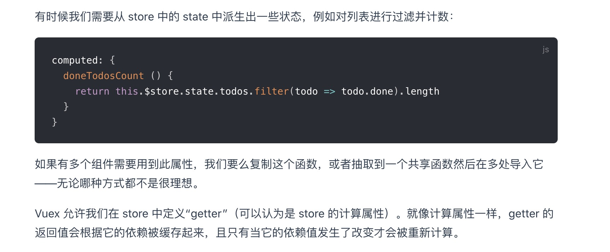
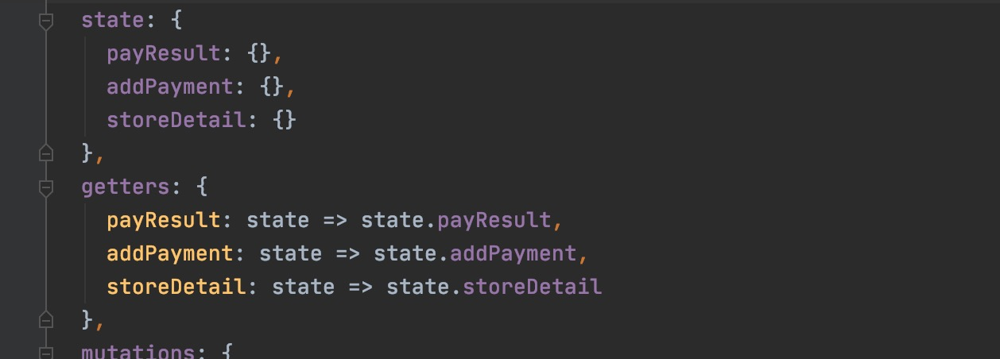
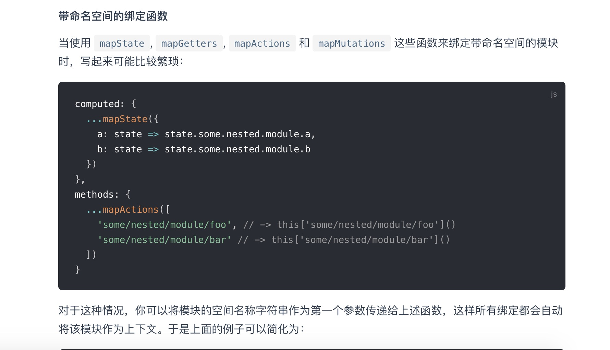
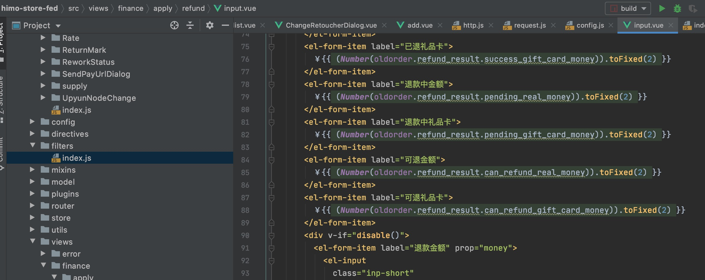
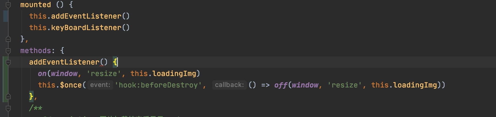
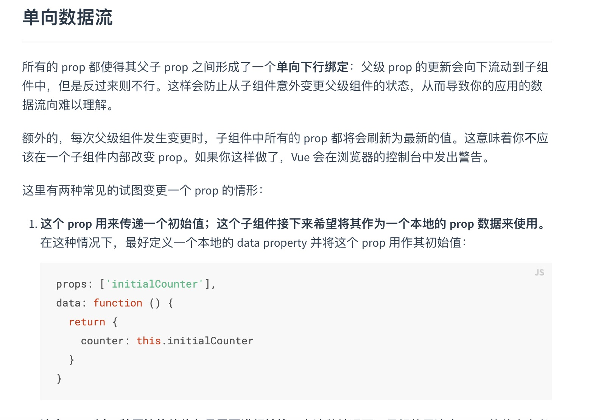
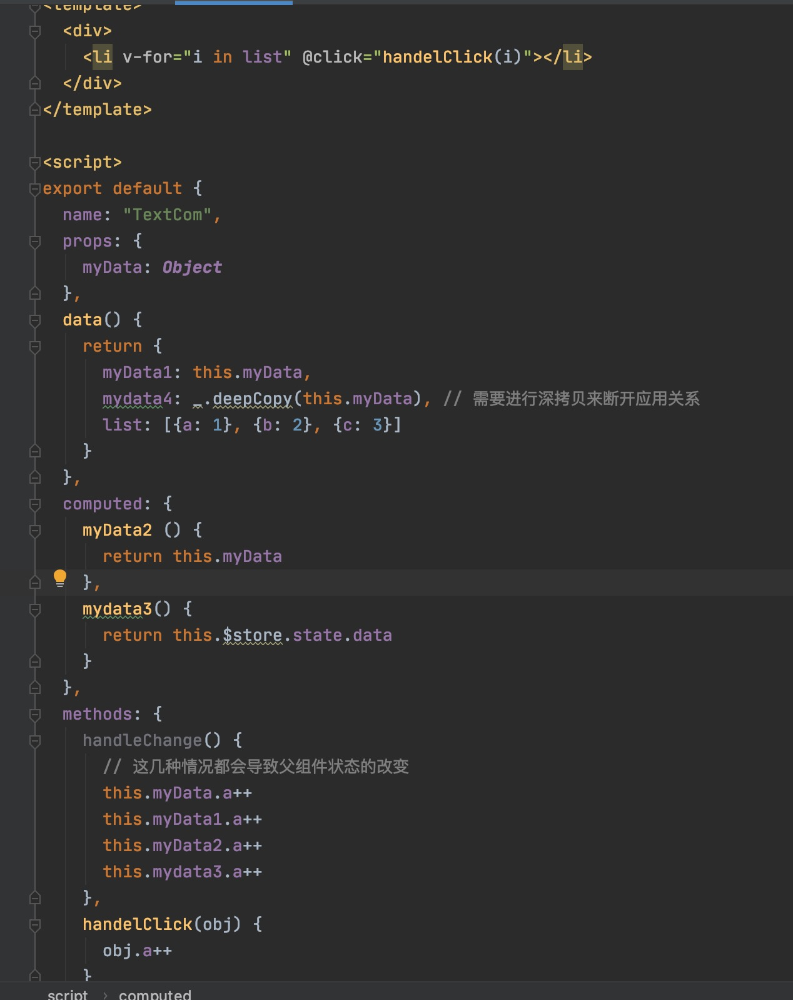
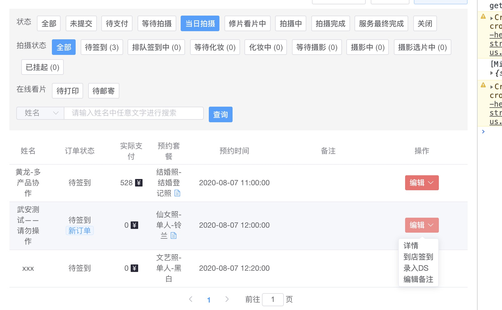
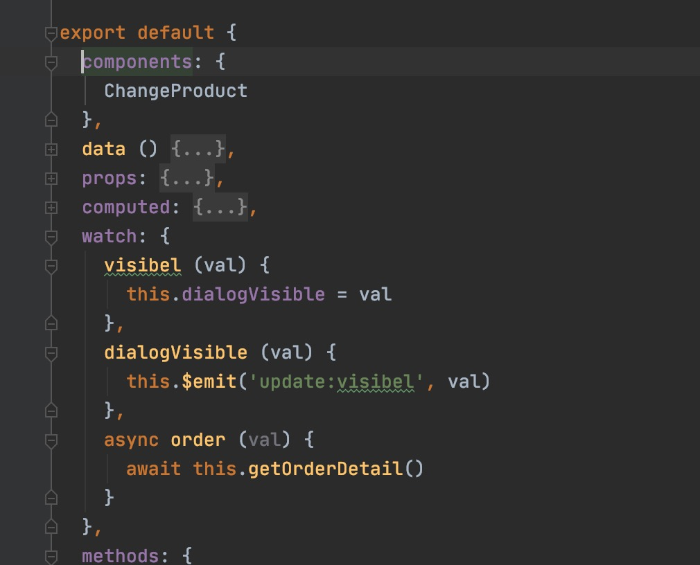

### 代码风格
##### 1，getters滥用情况

getters更适合用在数据派生的情况下，



在这种不对原始数据做任何处理的情况时，不需要使用getters来导出数据， 而是可以直接mapState辅助函数

#### 2， vuex命名空间
在项目相对复杂， vuex模块较多时， 推荐使用vuex命名空间
> 默认情况下，模块内部的 action、mutation 和 getter 是注册在全局命名空间的——这样使得多个模块能够对同一 mutation 或 action 作出响应。
如果希望你的模块具有更高的封装度和复用性，你可以通过添加 namespaced: true 的方式使其成为带命名空间的模块。当模块被注册后，它的所有 getter、action 及 mutation 都会自动根据模块注册的路径调整命名。例如：

在使用命名空间的情况下， 一方面便于在维护项目时查询`commit`,`action`的文件位置， 一眼就能看出来api所属的模块，
另一方面可以防止命名冲突和取名的痛苦，


#### 3，组件的name属性
好处是便于调试。有名字的组件有更友好的警告信息。另外，当在有 vue-devtools，未命名组件将显示成 `<AnonymousComponent>`，这很没有语义。通过提供 name 选项，可以获得更有语义信息的组件树。

#### 4,数字格式化可以使用过滤器


#### 5,loadsh和es6语法混用

#### 6,利用hook， 解构业务, 将事件监听和注销放在一起管理


#### 7, 组件拆分
建议通过规划容器组件和功能组件， 对页面进行更细粒度的拆分。 
遵循高内聚低耦合的原则进行组件拆分。尽量保证组件代码不超过500行。

#### 8， 数据冻结
如果你有一个巨大的数组或Object，并且确信数据不会修改，使用Object.freeze()可以让性能大幅提升，必要是可以使用深度冻结

### 风险项
#### 1， 严谨的数据流

无论是vue还是react都遵循单项数据流原则，原则上禁止子组建通过修改props的方式来修改父组建状态，
但是vue在数据的props、模板语法绑定的时候都是传递的引用类型， 在修改复杂类型数据的子节点的时候，可以绕开这个限制。
并且在修改数据之后也会触发视图的更新。这种情况包括
- 直接修改props的子节点
- 在computed返回一个数据的引用值的情况下修改computed的子节点
- 修改getter的子节点
- 直接将props的值复制给data
- 在v-for的时候， 通过事件修改入参的值



但是不推荐使用这种方式来处理，这样会导致数据流传不清， 增加维护成本, 而且会增加隐形的bug。

#### 2，dialog销毁
在下面这个组件中，

```vue
    <store-sign-dialog
      :order="activeOrder"
      :visibel.sync="signDialogVisible"
      :subscribed="subscribed"
      :hasHiddenProducts="hasHiddenProducts"
      :staffList="staffList"
      :loading="loading"
      @submit="onStoreSign"
      @refresh="fetchListData"
    />
```


当弹窗关闭之后， 这个组件并没有被销毁， 内部的watch仍然在工作， 
在父级组件切换activeOrder的时候， 这个组件虽然不展示， 但是内部的接口`getOrderDetail`依然被调用
并且在组件隐藏的时候， 还需要手动清除数据， 


::: tip 优化建议
使用v-if挂载组件， 必要的时候可以用`v-on="$listeners"`接管事件
```vue
    <store-sign-dialog v-if="isShow" @close="isShow = false" />
```
:::

### 工具调研
现有的日志工具中， 后端日志是基于接口形式的， 前端日志是错误监控， 在无纸化项目中， 缺少一个直观的基于业务流程的日志记录查询系统。
举个例子：
 订单号： XXX
- 20200810 09:00:00  门店端添加订单
- 20200810 10:00:00  门店端确认支付
- 20200810 10:00:00  门店端添加预约时间
- 20200810 10:00:00  门店端到店签到
- 20200810 10:00:00  门店端指派
- 20200810 10:00:00  xxx完成化妆

形式： 前端在特定接口触发时添加日志操作， 接入监控平台。

缺陷： 阶段调用频繁

解决方案： 通过某些方式控制日志是否上报。
