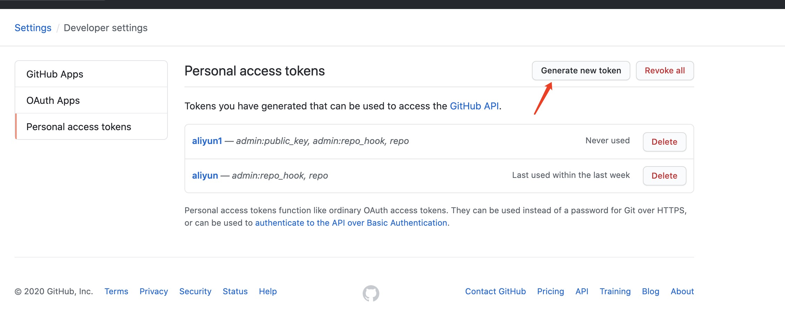
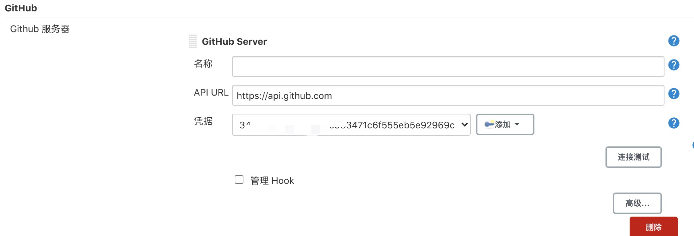
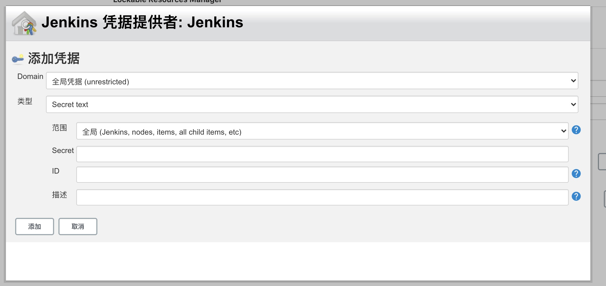
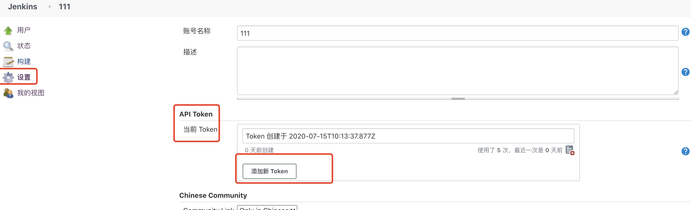
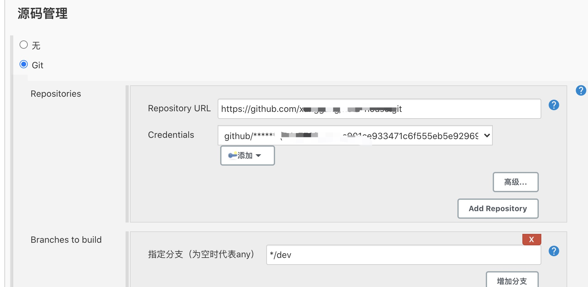
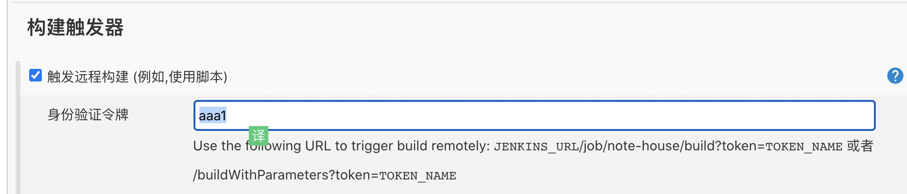
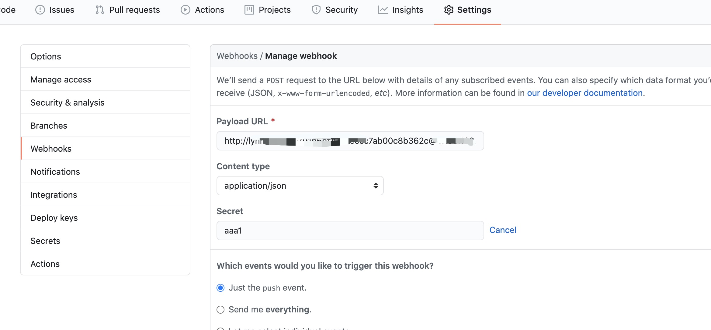
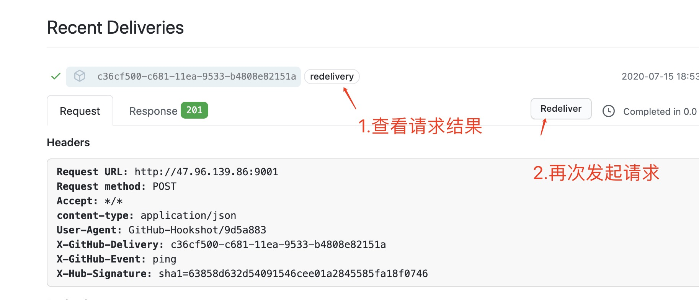
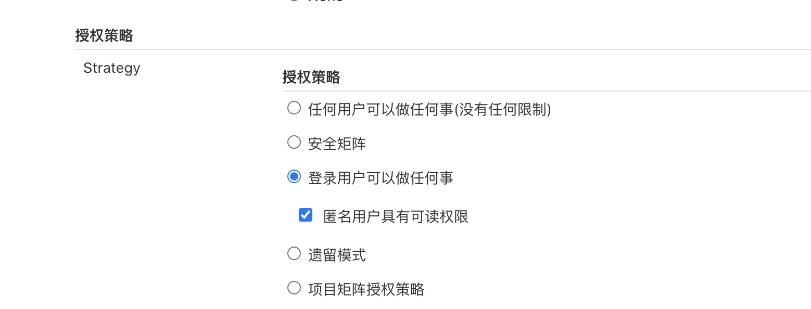
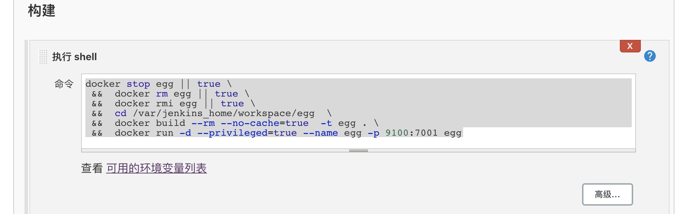

# 使用jenkins自动构建和部署web项目

### 准备工作
1，正确安装jenkins工具

2，登陆github， 点击右上角头像，依次点击Settings -》 Developer settings -》 Personal access tokens -》 Generate new token，
选择repo和admin:repo_hook， 然后点击 "Generate tocken"，保存好这个token， 离开这个页面之后就找不回来了哦



3，进入jenkins， 系统管理-系统配置， 找到Github服务器一栏，api-url填写`https://api.github.com`，


4，在凭据一栏， 点击添加，选择Secret Text， Secret添加刚才生成的token，id和描述随便填写， 填完之后点击连接测试
提示Credentials verified for user就配置好了


5，点击系统管理-管理用户-选择当前登陆的用户， 选择设置，在API Token一栏选择生成token， 这个token接下来会用到，


### 创建项目
1，在首页新建项目， 选择构建自由风格的软件项目

2，点开配置， 在源码管理选择git， 输入github中项目的的https地址

3，在Credentials中点击后面的添加-jenkins，选择刚加入的凭证


4，根据需要选择需要触发的分支

5，在构建触发器中选择触发远程构建， 填写随机的身份验证令牌, 这个令牌是项目的令牌， 不要记混了


这里可以保存一下

6，回到github的项目中，选择对应的项目， settings -》 webhook -》 Add webhook，
在Payload URL中填写`http://${user}:${userToken}@${url}/job/${jobName}/build?token=${jobToken}`, 
Secret中也填写jobToken，点击保存

::: tip
 注意解释一下：
 `http://${user}:${userToken}@${url}/job/${jobName}/build?token=${jobToken}`
 
- 这里的user是jenkins的账号， 
- userToken是上面准备工作中生成的账号的token
- url 是jenkins的地址
- jobName 是jenkins项目的名称
- jobToken 是在第5步中项目的token

这个地址在浏览器中也可以直接触发构建， 401和403一般都是token配置错误
:::

保存之后会自动生成一次请求， 然后可以在这里测试连接


::: tip
如果所有配置都正确还是出现401或者403， 可以去全局安全策略里改一下授权策略

:::

### 编写构建命令
不同的项目情况不同， 这里我分享两种情况

#### 使用docker构建node服务
在node项目内准备好dockerfile文件， 
``` dockerfile
# 设置基础镜像,如果本地没有该镜像，会从Docker.io服务器pull镜像
# node:alpine是精简过的node镜像
FROM node:alpine

WORKDIR /app

COPY package.json /app/

RUN npm install -g cnpm --registry=https://registry.npm.taobao.org

RUN cnpm install

COPY . /app/

# 暴露容器端口
EXPOSE 7001

CMD npm run start:prod
```
在jenkins中构建， 选择执行shell
``` shell script
docker stop egg || true \
 &&  docker rm egg || true \
 &&  docker rmi egg || true \
 &&  cd /var/jenkins_home/workspace/egg  \
 &&  docker build --rm --no-cache=true  -t egg . \
 &&  docker run -d --privileged=true --name egg -p 9100:7001 egg
```


#### 使用nginx启动vuepress博客
在项目根目录添加Dockerfile文件
```dockerfile
FROM node:alpine as builder

WORKDIR /app

COPY /package.json /app/

RUN npm install -g cnpm --registry=https://registry.npm.taobao.org
RUN cnpm install

COPY . /app/

# 打包
RUN npm run build

FROM nginx:latest

WORKDIR /app

# 复制到nginx镜像下
# 注意vuepress的打包目录
COPY --from=builder /app/docs/.vuepress/dist/ /app/ 

# 使用根项目下的nginx配置
COPY nginx.conf /etc/nginx/nginx.conf

```

```
user  nginx;
worker_processes  1;
error_log  /var/log/nginx/error.log warn;
pid        /var/run/nginx.pid;

events {
  worker_connections  1024;
}

http {
  include       /etc/nginx/mime.types;
  default_type  application/octet-stream;
  log_format  main  '$remote_addr - $remote_user [$time_local] "$request" '
  '$status $body_bytes_sent "$http_referer" '
  '"$http_user_agent" "$http_x_forwarded_for"';
  access_log  /var/log/nginx/access.log  main;
  sendfile        on;
  keepalive_timeout  65;
  server {
    listen       80;
    location / {
      root   /app;  # 指向目录
      index  index.html;
      try_files $uri $uri/ /index.html;
    }
    error_page   500 502 503 504  /50x.html;
    location = /50x.html {
      root   /usr/share/nginx/html;
    }
  }
}

```
在jenkins中构建， 选择执行shell
``` shell script
docker stop egg || true \
 &&  docker rm egg || true \
 &&  docker rmi egg || true \
 &&  cd /var/jenkins_home/workspace/egg  \
 &&  docker build --rm --no-cache=true  -t egg . \
 &&  docker run -d --privileged=true --name egg -p 9100:7001 egg
```

