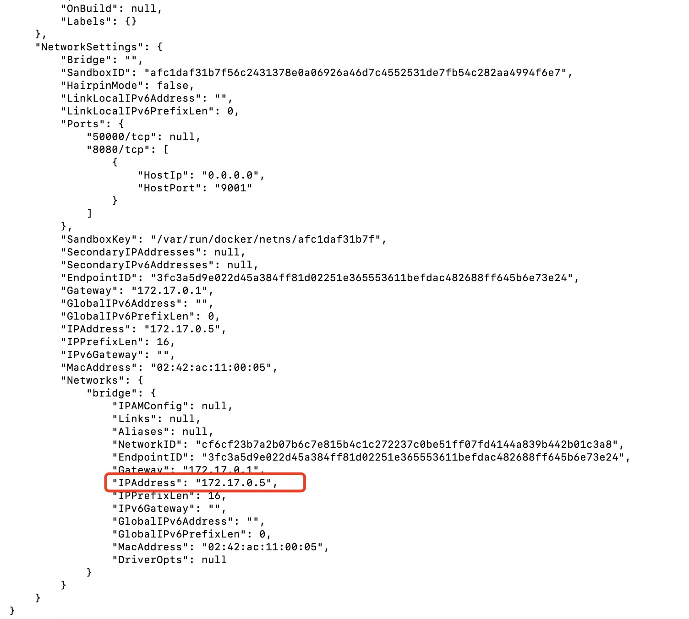
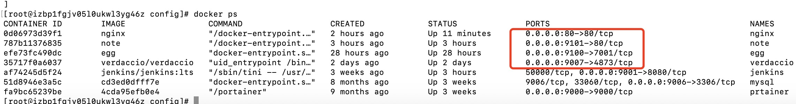

 域名备案好了之后， 准备通过二级域名来分别映射几个不同的服务， 准备使用nginx来进行端口的代理， 下面记一下过程， 备忘
 
 #### 启动主nginx容器
 这个nginx容器是主nginx容器， 端口映射到服务期的80端口， 然后根据不用的二级域名转发到其他的docker端口里去
 
 ```shell script
docker run -d -p 80:80 \
    --restart=always \
    -v /root/nginx-data/logs:/var/log/nginx \
    -v /root/nginx-data/config/nginx.conf:/etc/nginx/nginx.conf \
    -v /root/nginx-data/conf.d:/etc/nginx/conf.d \
    -v /root/nginx-data/www:/usr/share/nginx/ \
    --name nginx \
    nginx
```
在上面的配置中将日志目录，主配置都挂载到宿主机， 方便以后更改， `/root/nginx-data/www`是用来留给以后的其他静态页面使用的。 一个静态页面一个docker容器过于浪费。

#### 准备地址和端口
在这里假设我们注册的域名是a.com， 然后准备将blog.a.com 映射为博客站， jenkins.a.com映射为jenkins的首页。

因为我们的nginx服务也是docker化的， 端口代理的实质是从一个docker容器的内部代理到另一个docker中， 所以在nginx的代理配置的时候不能直接使用`127.0.0.1`， 而应该
通过docker内部的地址。

我们使用`docker inspect CONTAINER_NAME`来查看容器信息， 其中`Gateway`就是主机的地址，`IPAddress`是对应容器的地址， 我们记号这个地址

然后运行命令`docker ps ` 可以看到这个容器监听的内部端口， 前面的是宿主机端口， 后面的是容器的端口


#### 修改nginx配置
准备好了接口地址， 我们修改这个nginx的配置文件
```nginx
user  nginx;
worker_processes  1;

error_log  /var/log/nginx/error.log warn;
pid        /var/run/nginx.pid;


events {
    worker_connections  1024;
}


http {
    include       /etc/nginx/mime.types;
    default_type  application/octet-stream;

    log_format  main  '$remote_addr - $remote_user [$time_local] "$request" '
                      '$status $body_bytes_sent "$http_referer" '
                      '"$http_user_agent" "$http_x_forwarded_for"';

    access_log  /var/log/nginx/access.log  main;

    sendfile        on;
    #tcp_nopush     on;

    keepalive_timeout  65;

    #gzip  on;

    server {
        listen       80;
        server_name www.a.com; # 这里是一级域名， 直接返回一个首页的模板文件
        location / {
          root   /usr/web;
          index  index.html;
          try_files $uri $uri/ /index.html;
        }

    }
    server {
        listen 80;
        server_name blog.a.cool; # 二级域名blog.a.cool， 我们将它代理到http://172.17.0.8:80;这个服务
        location / {
          proxy_set_header X-Real-IP $remote_addr;
            proxy_set_header Host $http_host;
            proxy_pass http://172.17.0.8:80;
        
        }
    }

    server {
        listen 80;
        server_name jenkins.a.cool;  # 二级域名jenkinsa.cool， 我们将它代理到http://172.17.0.5:8080;这个服务
        location / {
          proxy_set_header X-Real-IP $remote_addr;
            proxy_set_header Host $http_host;
            proxy_pass http://172.17.0.5:8080;

        }
    }


    include /etc/nginx/conf.d/*.conf;
}
        
```
最后运行`docker restart nginx`重启nginx服务， 我们的二级域名代理就完成了
