## 前言
这一篇主要是介绍下node端数据处理和收集的方案，选用的是阿里开源的egg框架，数据库mysql，数据库工具egg-sequelize、毕竟不是专业的后端开发，sql就
处理的很简陋了。大家看看思路就好了。

## 框架
这里用的egg框架， 是我比较喜欢的node框架了， 好上手而且可以生态完善。后面会按照egg约定的
Model、Controller 、Service接口来介绍

## 数据库
数据库方面简单的分成了6张表用来存储数据
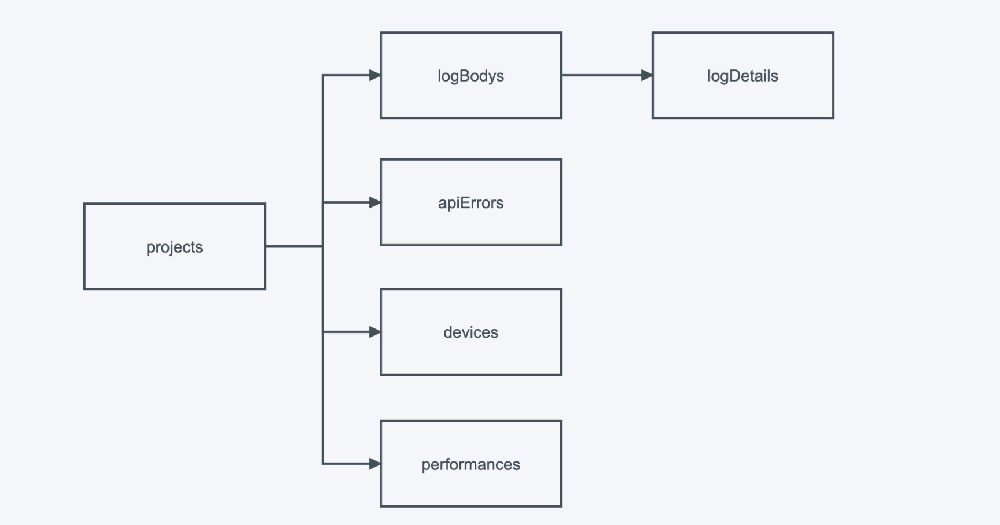

## projects模块
没啥好说的， 简单的几个字段，在创建的时候会为项目生成一个appKey 用于后续提交日志的校验
### Model
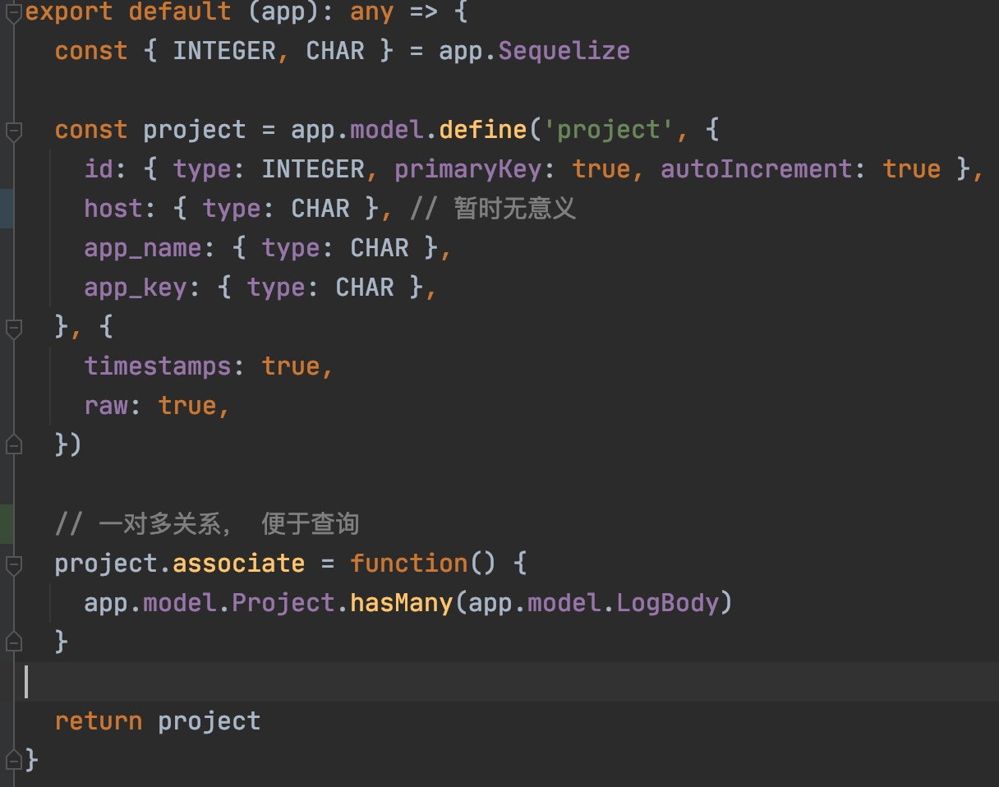

### Controller
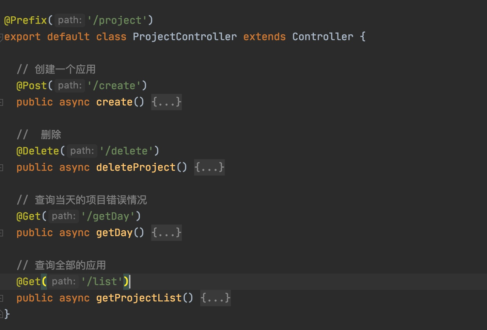

### Service
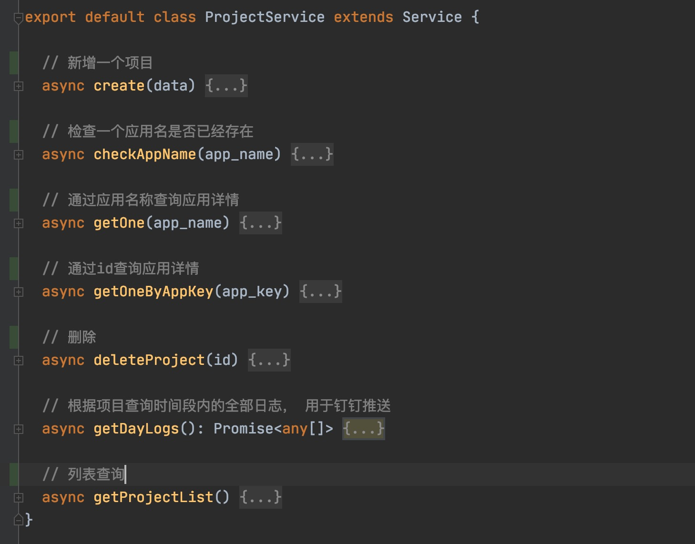

## 错误日志模块
这个模块包含两张表，logBodys和logDetails, 从业务流程上来说
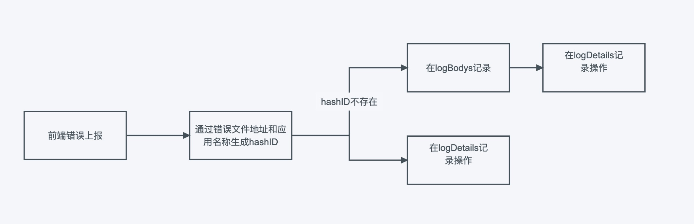

值得说的就下面几点
### 通过Stream的方式来进行文件上传
这种方法适合简单的场景， 直接将js.map传到服务器， 但是会造成服务器磁盘的浪费， 还要注意清理文件的方法，
更好的方式是将文件传到七牛等对象存储服务， 然后需要的时候远程读取
```typescript FileController

  @Post('/upload-map')
  public async uploadSourceMap() {
    const { ctx } = this
    const stream = ctx.req
    const { fileName, appName } = this.ctx.query
    const isRepeat = await this.ctx.service.project.checkAppName(appName)
    if (!isRepeat) {
      ctx.status = 500
      ctx.body = '应用名不存在, 请先创建对应的应用'
      console.error('应用名不存在, 请先创建对应的应用')
      return
    }
    try {
      const dir = path.join('./app/public', appName)
      if (!fs.existsSync(dir)) {
        fs.mkdirSync(dir)
      }
      const filePath = path.join('./app/public', appName, fileName)
      const writeStream = fs.createWriteStream(filePath)
      stream.pipe(writeStream)
      ctx.body = 'success'
      ctx.state = 200

    } catch (e) {
      ctx.state = 500
      throw new Error(e)
    }

  }
```

### logBodys和logDetails是一对多关系
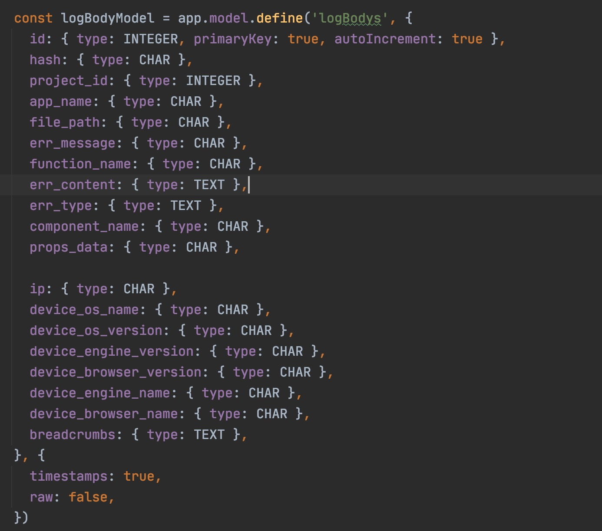
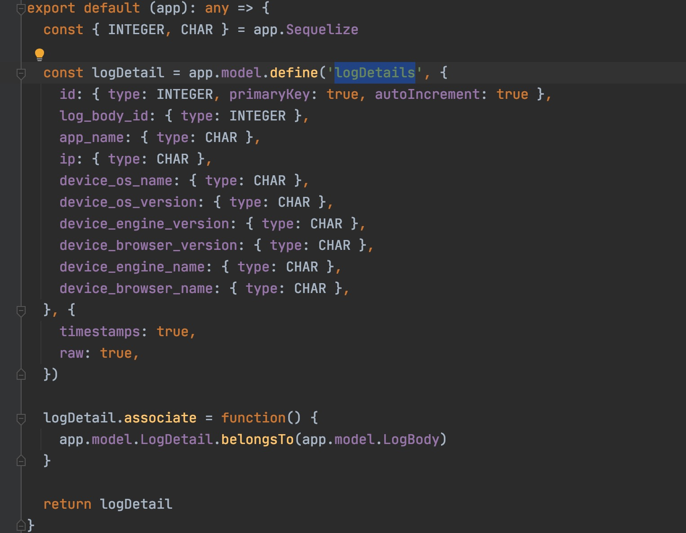
其中logBodys主要记录错误内容、用于行为等等数据，而logDetails主要用于统计数量、浏览器分布、ip分布等等。
在错误上报的时候， 通过错误的文件地址、错误信息来对错误分组，相同的错误只在logBodys中记录一次，后续只刷新时间。
在logDetails中记录全部

### 错误文件解析
这里选择在体制上传的时候就将错误内容解析出来，后续如果项目或者js.map被删除不影响之前的数据查询
```typescript
 async uploadLog(data) {
    const { app_name, ip } = data
    const project = await this.ctx.service.project.getOne(app_name)

    let err_message,
      err_type,
      error,
      err_content,
      function_name

    const file_path = _.get(data, 'exception.transaction')

    const breadcrumbs = _.get(data, 'userBehavior')

    // 解析错误源码
    const exception = _.get(data, [ 'exception', 'values', 0 ])
    if (exception) {
      err_type = exception.type
      err_message = exception.value
      const frames = _.get(exception, [ 'stacktrace', 'frames' ], [])
      error = frames[frames.length - 1] || {}
      function_name = error.function
    }
    // vue模式， 解析vue组建信息
    const component_name = _.get(data, [ 'vueData', 'componentName' ])
    const props_data = _.get(data, [ 'vueData', 'propsData' ], '')
    // 解析用户数据
    const device = data.device || {}

    const {
      device_os_name,
      device_os_version,
      device_engine_version,
      device_browser_version,
      device_engine_name,
      device_browser_name,
    } = device

    const hash = getHash(err_message, file_path)
    const historyLogs = await this.ctx.service.logBody.getLogByHash(app_name, hash)
    let historyLog: any = historyLogs[0] || {}
    // 这一条bug以前没有记录过
    if (!historyLogs.length) {
      // 解析bug
      if (file_path && error && error.lineno && error.colno) {
        const sourceMapPath = await getSourceMapPath(app_name, file_path)
        if (sourceMapPath) {
          const sourceMap = fs.readFileSync(sourceMapPath)
          err_content = await sourceMapDeal(
            sourceMap.toString(),
            error.lineno,
            error.colno, 1)
        }
      }
      err_content = err_content && err_content.length > 10000 ? 'too long' : err_content
      // 保存错误体
      const saveData: any = {
        app_name,
        ip,
        hash,
        device_os_name,
        device_os_version,
        device_engine_version,
        device_browser_version,
        device_engine_name,
        device_browser_name,
        err_message,
        err_type,
        file_path,
        err_content,
        function_name,
        component_name,
      }
      if (props_data) {
        saveData.props_data = JSON.stringify(props_data)
        saveData.breadcrumbs = JSON.stringify(breadcrumbs)
      }
      historyLog = await this.ctx.service.logBody.create(saveData)
      project.addLogBody(historyLog)
    }
    const detail = await this.ctx.service.logDetail.create({
      ip,
      app_name,
      device_os_name,
      device_os_version,
      device_engine_version,
      device_browser_version,
      device_engine_name,
      device_browser_name,
    })
    const res = await historyLog.addLogDetails(detail)
    await historyLog.update({ updated_at: dayjs().format('YYYY-MM-DD HH:mm:ss') })
    return res
  }
```
相关的工具方法
```typescript

import sha256 from 'sha256'
import { SourceMapConsumer } from 'source-map'
import path from 'path'
import fs from 'fs'

// eslint-disable-next-line @typescript-eslint/ban-ts-ignore
// @ts-ignore
SourceMapConsumer.initialize({
  'lib/mappings.wasm': 'https://unpkg.com/source-map@0.7.3/lib/mappings.wasm',
})

/**
 * 通过错误信息和错误的文件计算哈希
 * @param msg
 * @param file
 */
export function getHash(msg: string, file: string): string {
  return sha256(msg + file)
}

/**
 * 转义html标签。 否则vue无法展示
 * @param sHtml string
 */
function html2Escape(sHtml: string | undefined) {
  if (typeof sHtml !== 'string') {
    return sHtml
  }
  return sHtml.replace(/[<>&"]/g, function(c) {
    return {
      '<': '&lt;',
      '>': '&gt;',
      '&': '&amp;',
      '"': '&quot;',
    }[c]
  })
}

/**
 * 解析sourceMap 返回编译前的源码
 * @param rawSourceMap
 * @param line
 * @param column
 * @param offset
 */
export async function sourceMapDeal(rawSourceMap: any, line, column, offset = 5): Promise<string> {
  // 通过sourceMap库转换为sourceMapConsumer对象
  const consumer = await new SourceMapConsumer(rawSourceMap)
  // 传入要查找的行列数，查找到压缩前的源文件及行列数
  const sm: any = consumer.originalPositionFor({
    line, // 压缩后的行数
    column, // 压缩后的列数
  })
  // 压缩前的所有源文件列表
  const { sources } = consumer
  // 根据查到的source，到源文件列表中查找索引位置
  const smIndex = sources.indexOf(sm.source)
  // 到源码列表中查到源代码
  const smContent = consumer.sourcesContent[smIndex]
  // 将源代码串按"行结束标记"拆分为数组形式
  const rawLines = smContent.split(/\r?\n/g)

  let begin = sm.line - offset
  const end = sm.line + offset + 1
  begin = begin < 0 ? 0 : begin

  let stringList = ''

  // 错误的行标红
  for (let i = begin; i <= end; i++) {
    const code = html2Escape(rawLines[i])
    if (i === sm.line - 1) {
      stringList += `<code class="red"><pre>${code} </pre></code>`
    } else {
      stringList += rawLines[i] ? `<code><pre>${code} </pre></code>` : ''
    }
  }

  // 记得销毁
  consumer.destroy()
  return stringList
}

// 读取sourceMap路径
export async function getSourceMapPath(appName: string, file_path: string): Promise<string | null> {
  const file_name = path.basename(file_path) + '.map'
  const sourceMapPath = path.join('./app/public', appName, file_name)
  if (fs.existsSync(sourceMapPath)) {
    return sourceMapPath
  }
  return null
}

```

### 分页查询
egg-sequelize本身没有提供特别好的分页查询方法， 所以使用起来比较难搞， 后面可以封装一下
```typescript
  // 分页查询
  public async getList(par) {
    console.log(par)
    const {
      page = 1,
      limit = 10,
      projectId,
      startTime,
      endTime,
      order = 'desc',
    } = par
    const query: any = {
      order: [[ 'created_at', order ], [ 'id', 'desc' ]],
      where: {
        project_id: projectId,
      },
      offset: (page - 1) * limit,
      limit,
      include: [ // 关联查询
        { model: this.ctx.model.LogDetail },
      ],
      distinct: true,
    }

    if (startTime || endTime) {
      query.where.updatedAt = {
        [Op.gt]: startTime
          ? +new Date(startTime)
          : +new Date('2020-01-01 00:00:00'),
        [Op.lt]: endTime
          ? +new Date(endTime)
          : +new Date(),
      }
    }
    const logBodyList = await this.ctx.model.LogBody.findAndCountAll(query)

    return logBodyList
  }
```

### 查询错误信息的时候需要携带apiKey用来区分项目

## apiErrors模块
apiErrors记录请求错误， 查询的时候需要统计一个错误的数量
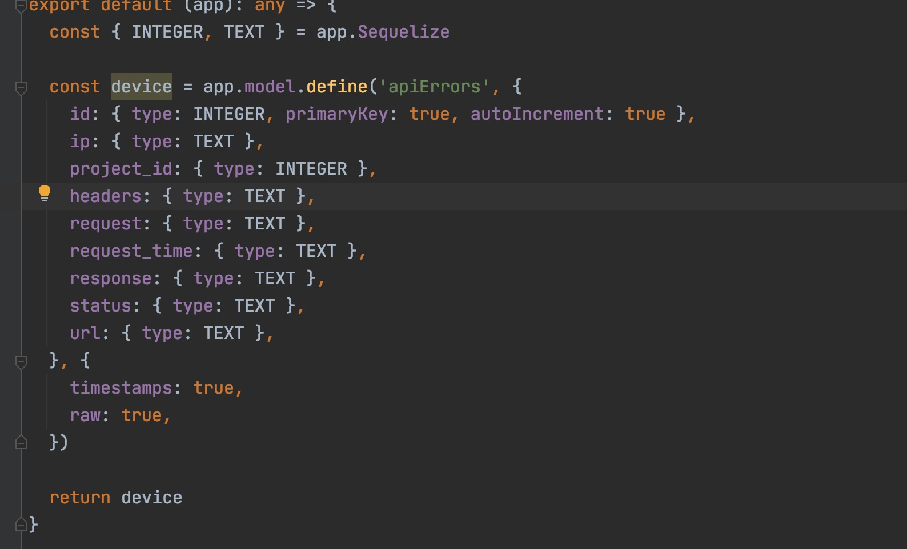
```typescript
  // 分组求和
  async getApiErrorsStatistics(par) {
    const {
      page = 1,
      limit = 10,
      project_id,
      start_time,
      end_time,
      order = 'desc',
    } = par

    const res: any = await this.ctx.model.ApiError.findAndCountAll({
      order: [[ 'created_at', order ], [ 'id', 'desc' ]],
      where: {
        project_id,
        updatedAt: {
          [Op.gt]: +new Date(start_time),
          [Op.lt]: +new Date(end_time),
        },
      },
      limit,
      offset: (page - 1) * limit,
      raw: true,
      distinct: true,
    })

    const list: any = []
    const urlSet = new Set()
    if (!res.rows?.length) {
      return {
        rows: [],
        count: 0,
      }
    }
  // todo 通过sql实现，这样太耗费性能了
    for (const data of res.rows) {
      const url = data.url
      if (urlSet.has(url)) {
        continue
      }
      urlSet.add(url)
      const count = await this.ctx.model.ApiError.count({
        where: {
          project_id,
          updatedAt: {
            [Op.gt]: +new Date(start_time),
            [Op.lt]: +new Date(end_time),
          },
          url,
        },
        raw: true,
      })
      data.count = count
      list.push(data)
    }
    return {
      rows: list,
      count: list.length,
    }
  }
```

## devices模块
devices模块也记录了uv和pv的数据
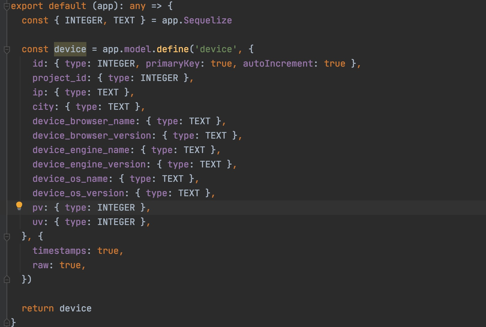
这里用了最简单的方式， 同一个ip24小时内只算一个uv。展示的时候对时间段的数据求和
```typescript
  // 查询一个阶段内的全部统计数据
  async getDeviceStatistics(par) {
    const {
      project_id,
      start_time,
      end_time,
      type,
    } = par
    return this.ctx.model.Device.findAll({
      where: {
        project_id,
        updatedAt: {
          [Op.gt]: +new Date(start_time),
          [Op.lt]: +new Date(end_time),
        },
      },
      group: type,
      attributes: [
        [ type, 'name' ],
        [ fn('SUM', col('pv')), 'value' ],
      ],
      raw: true,
    })
  }
```

## performance模块
performance模块也很简单，直接对数据进行平均数
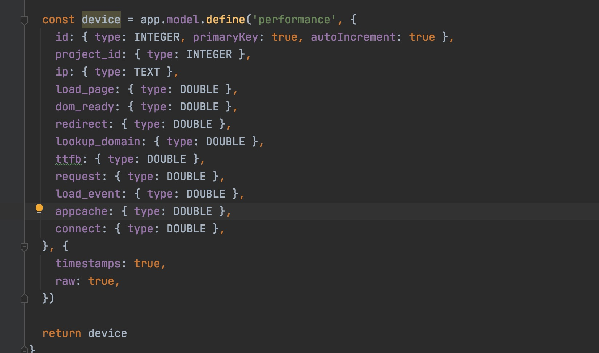
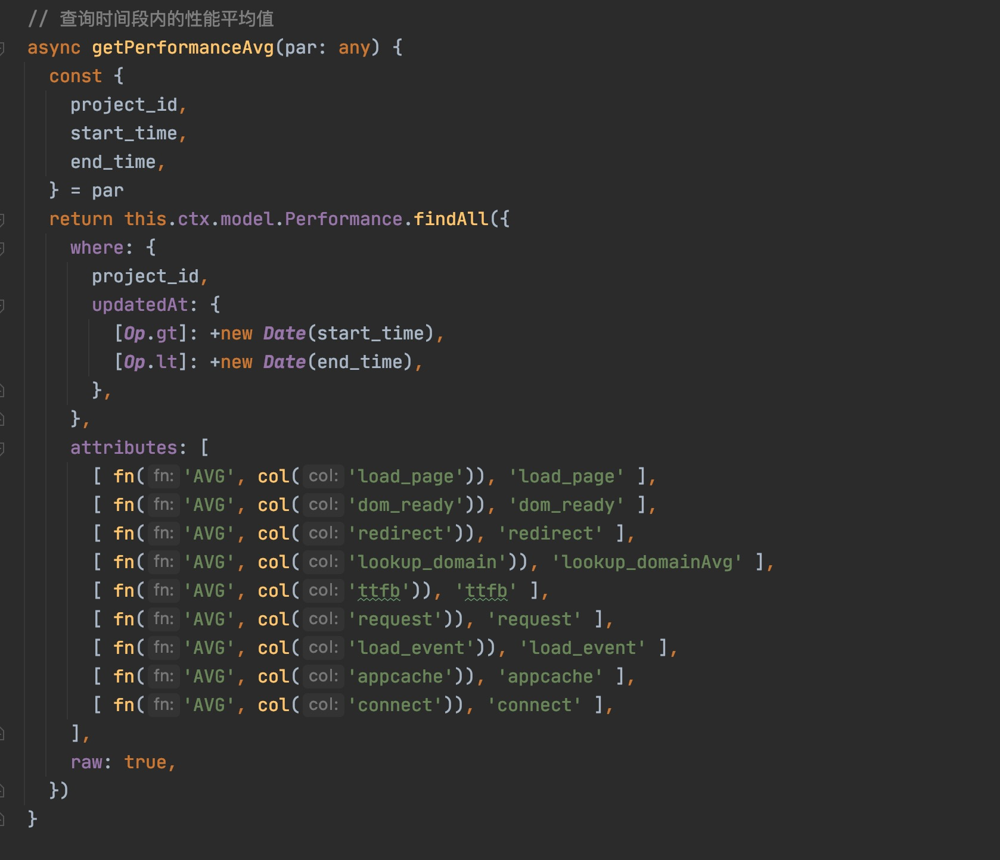

## 数据上报
sdk上传的时候都是批量上传， node根据上报的数据类型分别调用服务处理
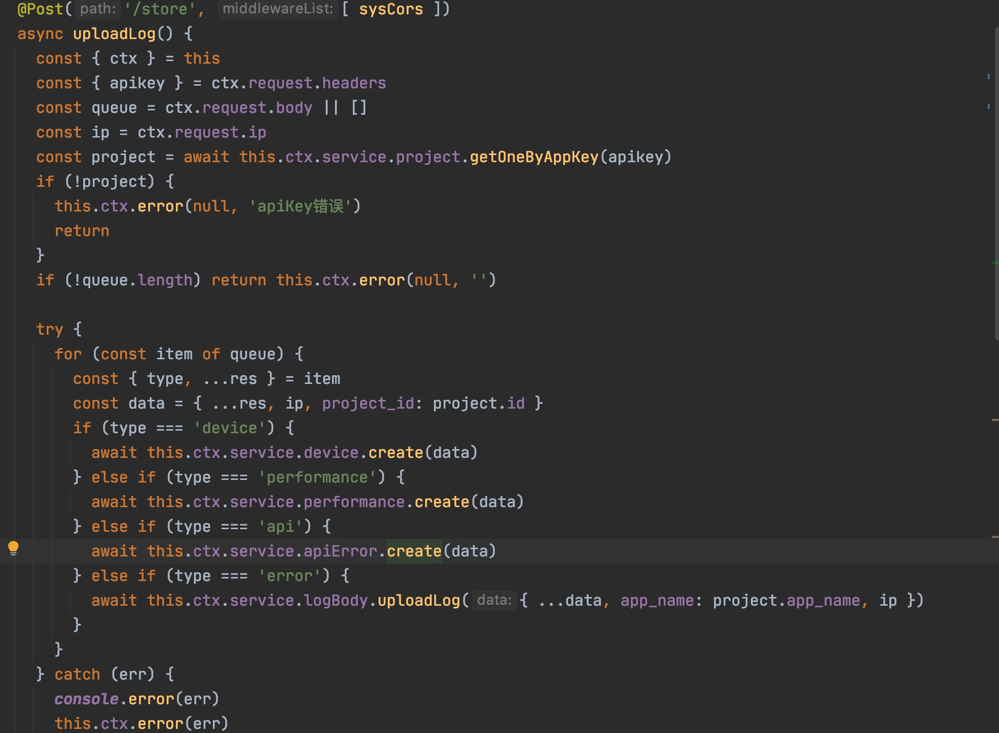

## 跨域设置
egg-cors只能设置跨域白名单，没有接口级别的跨域设置，但是我们需求是数据上报的接口是允许跨域的，所以写了一个中间件用于跨域的配置，
```typescript
export default async function(ctx, next) {
  ctx.set('Access-Control-Allow-Origin', '*')
  await next()
}
```

## 钉钉消息推送
钉钉的群推送是通过webhook来实现的。 只需要在钉钉群组-设置-智能群助手-添加机器人-添加webhook机器人， 
然后定时朝这个地址推送消息。
egg框架内置了定时任务的配置， 只需要在schedule中添加配置就好了。
```typescript
import { Subscription } from 'egg'

function getMessage(data: any[]) {
  let st = '#### **前端业务通知**\n'
  data.forEach(item => {
    st += `***\n**项目名称**：${item.name}\n\n**错误数量**：${item.total}\n***\n`
  })
  st += '[查看详情](http://owl-web.lynn.cool/)'
  return st
}


class UpdateCache extends Subscription {
  // 通过 schedule 属性来设置定时任务的执行间隔等配置
  static get schedule() {
    return {
      interval: '0 54 14 * * *', // 每天18点执行
      type: 'worker', // 每台机器上只有一个 worker 会执行这个定时任务，每次执行定时任务的 worker 的选择是随机的。
    }
  }

  // subscribe 是真正定时任务执行时被运行的函数
  async subscribe() {
    console.log('定时任务更新')
    const data = await this.ctx.service.project.getDayLogs()
    const res = await this.sendMessage(getMessage(data))
    console.log(res)
  }

  async sendMessage(string: string) {
    const url = 'https://oapi.dingtalk.com/robot/send?access_token=token'
    return await this.app.curl(url, {
      method: 'POST',
      contentType: 'json',
      dataType: 'json',
      data: {
        markdown: {
          title: '前端业务通知',
          text: string,
        },
        msgtype: 'markdown',
      },
    })
  }

}

module.exports = UpdateCache

```
## 项目中的路由装饰器
项目中的路由装饰器是基于另一个库封装的， 在另一篇博客里。
