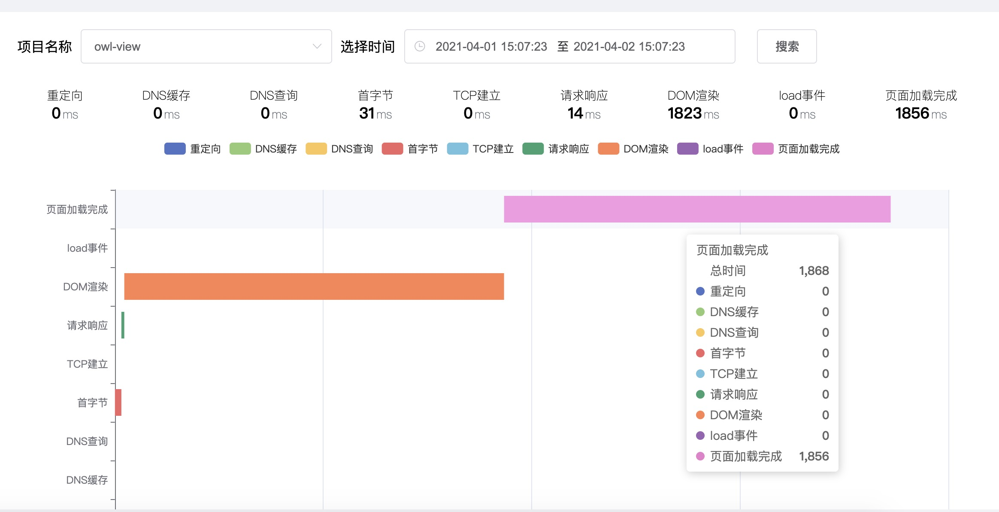

## 前言
前端监控一直开发生产中很重要的一环， 作为开发者， 很难察觉到客户端遇到的错误情况和日志，而一个成熟的监控平台可以为
开发着和运营提供完整的客户端数据，对于运营来说，可以提供包括客户端访问量、留存、UV、PV的关键运营数据， 对于开发着来说
可以对项目实现性能监控、错误监控、浏览器占比等信息。无论对于大公司还是小公司，一个监控平台可以说是必不可缺的了。
本文实现的是一个监控平台的基本实现的系列文章， 包含前端错误监控、浏览器占比、性能分析、PV统计、接口错误统计等基础功能。

## 技术选型和流程
项目总体包含前端数据展示owl-view、服务器owl-node、错误收集上报owl-sdk、配套工具owl-util四个项目。
在技术选型上， 前端sdk参考Sentry，数据库为mysql，服务器端使用Egg框架， 前端展示使用vue + element实现。
中间也会包含一些工程化的实践


## 错误sdk收集上报
sdk作为错误和数据收集和上报的工具， 包含上传错误信息、收集分析页面加载性能、收集上报请求错误信息、收集设备信息、PVUV信息收集等等，

:::tip
很多功能和设想都还没有具体实现， 有时间在填坑吧
:::

### 常规脚本错误
通过监听onerror事件可以捕获常规的脚本错误
``` javascript
  public instrumentError() {
    const _oldOnErrorHandler = window.onerror;
    const that = this
    window.onerror = function(msg: any, url: any, line: any, column: any, error: any): boolean {
      // 解析错误内容
      const res = globalOnErrorHandler({ msg, url, line, column, error })

      if (_oldOnErrorHandler) {
        return _oldOnErrorHandler.call(null, msg, url, line, column, error);
      }
      // 上报
      that.formatData(res)
      return false;
    };
  }
```
这里我们通过tracekit这个库可以将错误数据解析成我们需要的关键信息。
``` javascript
  {
    "exception": {
      "values": [
        {
          "type": "TypeError", // 错误类型
          "value": "Cannot read property 'forEach' of undefined", // 具体的错误信息
          "stacktrace": {
            "frames": [
              // ... 错误栈
              {
                "colno": 54951, // 错误的列
                "filename": "http://localhost:3000/js/about.dc30fc55.js", // 脚本地址
                "function": "o.run4", // 产生错误的函数名称
                "lineno": 1 // 产生错误的行
              }
            ]
          }
        }
      ],
      "transaction": "http://localhost:3000/js/chunk-vendors.4d9d5a8f.js" // 脚本地址
    }
```

### Promise 错误
通过监听onunhandledrejection事件可以捕获Promise 错误
``` javascript
window.onunhandledrejection = function(e: Error): boolean {
  // 解析错误内容
  const res = globalOnUnhandledRejectionHandler(e)
  // 处理其他的错误监听
  if (_oldOnUnhandledRejectionHandler) {
    return _oldOnUnhandledRejectionHandler.apply(this, e);
  } 
  // 上报错误
  that.formatData(res)
  return true;
};
```

### Vue框架错误
vue提供了errorHandler来收集vue的内部错误， 通过还可以通过errorHandler传入的vm实例来收集vue内部数据，
这里我们将错误处理封装成vue的插件， 通过vue.use来注册
``` javascript
class LogSdkVue extends LogSdk {
  // vue.use
  install (Vue: any) {
    const errorHandler = (error: any, vm: any, info: any)=>{
      if (error.isHandle) {
        return
      }
      error.isHandle = true
      const _oldOnError = Vue.config.errorHandler
      this.emitVueError(error, vm)
      _oldOnError.call(Vue, error, vm, info)
    }
    Vue.config.errorHandler = errorHandler
  }
}
```

``` typescript
import {eventFromStacktrace} from "./util/utils";
import {computeStackTrace} from "./util/tracekit";

const ANONYMOUS_COMPONENT_NAME = 'anonymous component'
const ROOT_COMPONENT_NAME = 'root'

// 获取组件名称
function getComponentName(vm: any): string {
  // Such level of granularity is most likely not necessary, but better safe than sorry. — Kamil
  if (!vm) {
    return ANONYMOUS_COMPONENT_NAME;
  }

  if (vm.$root === vm) {
    return ROOT_COMPONENT_NAME;
  }

  if (!vm.$options) {
    return ANONYMOUS_COMPONENT_NAME;
  }

  if (vm.$options.name) {
    return vm.$options.name;
  }

  if (vm.$options._componentTag) {
    return vm.$options._componentTag;
  }

  return ANONYMOUS_COMPONENT_NAME;
}

export default function (err: any, vm: any) {
  const event = eventFromStacktrace(computeStackTrace(err as Error));

  return {
    ...event,
    vueData: {
      componentName: getComponentName(vm),
      propsData: vm.$options.propsData
    }
  }
}

```

### API请求错误
项目中使用的都是axios， 基于xhr， 所以只要重新xhr方法就可以实现对错误的监听。这里是在`loadend`事件中判断
请求是否成功、不成功则收集请求的状态吗、请求头、响应头，请求体等数据用于展示和分析
``` javascript
export default function globalOnHttpXHRHandler (oldXHR: any, cb: (d: any) => void): any {
  return () => {
    const realXHR = new oldXHR()
    let requestObj: any = {}
    const xhr_open = realXHR.open
    const xhr_send = realXHR.send
    const headers:any = {}
    const setRequestHeader = realXHR.setRequestHeader
    realXHR.open = function (...args: any) {
      requestObj = Object.assign({}, requestObj, {
        method: args[0],
        url: args[1],
      })
      xhr_open.apply(this, args)
    }
    realXHR.send = function (...args: any) {
      requestObj = Object.assign({}, requestObj, {
        body: args[0]
      })
      xhr_send.apply(this, args)
    }
    realXHR.setRequestHeader = function (...args: any) {
      // 在这里，我们加入自己的获取逻辑
      headers[args[0]] = args[1]
      setRequestHeader.apply(this, args)
    }
    realXHR.addEventListener('loadend', (ev: any) => {
      const status = ev?.target?.status
      if (status === 200) return
      if (ev?.target?.readyState !== 4) return
      if (!ev?.target?.responseURL) return
      const headerString = JSON.stringify(headers)
      const request = JSON.stringify(requestObj)
      const url = requestObj.url
      const responseText = ev?.target?.responseText
      const requestTime = +new Date()
      cb({
        status,
        headers: headerString,
        request,
        url,
        response: responseText,
        request_time: requestTime,
      })
    }, false)
    return realXHR
  }
```


### 错误缓存
在同一个客户端， 同一个错误往往会多次触发，这个时候只要第一次的上报就好了， 所以在处理错误的时候需要将错误进行缓存。
上报的时候过滤一下。 一般的错误通过错误的内容缓存，请求错误用请求地址来缓存
``` javascript
checkCache (data: any) {
    const type = data.type
    
    if (type === 'error') {
      const errorMessage = data?.exception?.values?.[0]?.value
      if (this.errorMap[errorMessage]) {
        return false
      } else {
        this.errorMap[errorMessage] = true
        return true
      }
    }
    if (type === 'api') {
      const url = data.url
      if (this.errorMap[url]) {
        return false
      } else {
        this.errorMap[url] = true
        return true
      }
    }
    
    return true
}
```

### 错误白名单
在某些场景下需要过滤一些错误， 可以通过白名单来过滤， 阻止上报（未实现）

### 代码组织
在这里将全部的错误监听事件注册上去， 并且提供vueHandler和customizeErrorHandler方法
```typescript
import globalOnErrorHandler from './globalOnErrorHandler'
import globalOnUnhandledRejectionHandler from './globalOnUnhandledRejectionHandler'
import globalOnHttpXHRHandler from './globalOnHttpXHRHandler'
import globalVueErrorHandler from './globalVueErrorHandler'
import UserBehavior from '../UserBehavior'
import Upload from "../Upload";
import Device from '../Device'

export default class ErrorHandle {
  upload: Upload
  userBehavior: UserBehavior
  deviceInfo: any

  constructor(upload: Upload) {
    this.upload = upload
    this.userBehavior = new UserBehavior()
    this.deviceInfo = Device.getDeviceInfo()
    this.instrumentError()
    this.instrumentUnhandledRejection()
    this.instrumentHttpXHR()
  }

  public formatData (res: any, type = 'error') {
    const data = Object.assign({}, res, {
      device: this.deviceInfo,
      userBehavior: this.userBehavior.pagePath,
      type,
    })
    console.log(data);
    this.upload.add(data)
  }

  public instrumentError() {
    const _oldOnErrorHandler = window.onerror;
    const that = this
    window.onerror = function(msg: any, url: any, line: any, column: any, error: any): boolean {
      const res = globalOnErrorHandler({ msg, url, line, column, error })

      if (_oldOnErrorHandler) {
        return _oldOnErrorHandler.call(null, msg, url, line, column, error);
      }
      that.formatData(res)
      return false;
    };
  }

  public instrumentUnhandledRejection(): void {
    const _oldOnUnhandledRejectionHandler = window.onunhandledrejection;
    const that = this
    window.onunhandledrejection = function(e: any): boolean {
      const res = globalOnUnhandledRejectionHandler(e)

      if (_oldOnUnhandledRejectionHandler) {
        return _oldOnUnhandledRejectionHandler.apply(this, e);
      }
      that.formatData(res)
      return true;
    };
  }

  public instrumentHttpXHR () {
    const oldXHR = window.XMLHttpRequest
    const that = this
    window.XMLHttpRequest = globalOnHttpXHRHandler(oldXHR, (res) => {
      if (res.url.includes(this.upload.uploadHost)) return
      this.formatData(res, 'api')
    })
  }

  public vueHandler(err: any, vm: any) {
    const event = globalVueErrorHandler(err, vm)
    this.formatData(event)
  }
  // 上报一个自定义事件
  public customizeErrorHandler (error: Error) {
    const event = eventFromStacktrace(computeStackTrace(error));
    this.formatData(event)
  }

}

```

## 系统设备信息上报
通过`ua-device`这个库分析`window.navigator.userAgent`获取浏览器的几个设备信息，
包括操作系统、操作系统版本号、浏览器名称、浏览器版本号、浏览器内核、浏览器内核版本号等等。内容相对简单
``` typescript

  static getDeviceInfo (): IDeviceInfo | null {
    if (window.navigator && window.navigator.userAgent) {
      const device: IUAResponse = new UA(window.navigator.userAgent)

      const device_os_name =  device?.os?.name
      // 操作系统版本
      const device_os_version = device?.os.version?.original
      // 浏览器名称
      const device_browser_name = device?.browser?.name
      // 浏览器版本
      const device_browser_version = device?.browser?.version?.original
      // 浏览器核心
      const device_engine_name = device?.engine?.name

      const device_engine_version = device?.engine?.version?.original


      return {
        device_browser_name,
        device_browser_version,
        device_engine_name,
        device_engine_version,
        device_os_name,
        device_os_version
      }
    }
    return null
  }
```

最后数据的展示结果


## 页面性能上报
通过浏览器的performance接口，可以获取页面的加载性能相关数据
```typescript

class Performance {
  upload: Upload

  constructor (upload: Upload) {
    this.upload = upload
    this.getTiming()
  }

  getTiming () {
    const performance = window.performance;

    if (!performance) {
      // 当前浏览器不支持
      console.warn('你的浏览器不支持 performance 接口')
      return
    }

    const t = performance.timing
    // 初次执行 dom 元素未挂载完成, performance对象未完全生成
    // 暂时通过定时器解决
    if (!t.loadEventEnd) {
      setTimeout(() => {
        this.getTiming()
      }, 1000)
      return
    }

    const times: TimingObj = {

      //【重要】页面加载完成的时间
      //【原因】这几乎代表了用户等待页面可用的时间
      load_page: t.loadEventEnd - t.navigationStart,

      //【重要】解析 DOM 树结构的时间
      //【原因】反省下你的 DOM 树嵌套是不是太多了！
      dom_ready: t.domComplete - t.responseEnd,

      //【重要】重定向的时间
      //【原因】拒绝重定向！比如，http://example.com/ 就不该写成 http://example.com
      redirect: t.redirectEnd - t.redirectStart,

      //【重要】DNS 查询时间
      //【原因】DNS 预加载做了么？页面内是不是使用了太多不同的域名导致域名查询的时间太长？
      lookup_domain: t.domainLookupEnd - t.domainLookupStart,

      //【重要】读取页面第一个字节的时间
      //【原因】这可以理解为用户拿到你的资源占用的时间，加异地机房了么，加CDN 处理了么？加带宽了么？加 CPU 运算速度了么？
      ttfb: t.responseStart - t.navigationStart,

      //【重要】内容加载完成的时间
      //【原因】页面内容经过 gzip 压缩了么，静态资源 css/js 等压缩了么？
      request: t.responseEnd - t.requestStart,

      //【重要】执行 onload 回调函数的时间
      //【原因】是否太多不必要的操作都放到 onload 回调函数里执行了，考虑过延迟加载、按需加载的策略么？
      load_event: t.loadEventEnd - t.loadEventStart,

      // DNS 缓存时间
      appcache: t.domainLookupStart - t.fetchStart,

      // TCP 建立连接完成握手的时间
      connect: t.connectEnd - t.connectStart,
    }

    // 兼容数据异常情况
    if (times.request > 10000) {
      this.upload.add({
        type: 'performance',
        ...times
      })
    }
  }
}

```



## 上报方法
sdk中封装了一个Upload方法用于上报信息， 这里考虑到每次上传都是批量的复杂数据， 没有选择img src的方式，
所以上报的时候会涉及到跨域问题， 需要在node特殊处理。

### apiKey
这里在上报的时候请求头加了一个`apiKey`用于在服务端进行权限和项目的区分

```typescript
import axios from 'axios'
import cache from './Cache'

interface IErrorMap {
  [key: string]: boolean
}

export default class Upload {

  public apiKey: string
  // 上传的node服务地址
  public uploadHost: string;

  // 额外附加的数据
  public metadata: any

  // 已经收集过的数据
  public errorMap: IErrorMap = {}

  // 需要发送的错误内容
  public queue: any[] = []

  public customizeRequest?: (data: any) => any

  timer: any = -1

  public constructor(uploadHost: string, apiKey: string, metadata?: {}) {
    this.uploadHost = uploadHost
    this.apiKey = apiKey
    this.metadata = metadata;
  }

  add (data: any) {
    if (cache.checkCache(data)) {
      this.queue.push(this.formatCustomizeRequest(data))
    }

    if (this.timer !== -1) {
      clearTimeout(this.timer)
    }
    this.timer = setTimeout(() => {
      this.send()
      this.timer = -1
    }, 2000)
  }

  send () {
    if (!this.queue.length) return
    axios.post(this.uploadHost, this.queue, {
      headers: { apiKey: this.apiKey }
    })
    this.queue = []
  }

  formatCustomizeRequest (data: any) {
    if (typeof this.customizeRequest === 'function') {
      return this.customizeRequest(data)
    }
    return data
  }
}

```

## 收集用户行为
在收集错误的同时， 也要记录下当前的操作信息， 包括路由跳转， 点击了什么标签等等， 这些信息有助于我们分析错误。
这里我们是监听鼠标点击事件， 记录下每次操作的信息， 

```typescript
interface IPagePathData {
  path: string;
  behavior: any[]
}

/**
 *  收集用户行为
 */
export default class UserBehavior {

  pagePath: IPagePathData[] = []

  get lastPath(): IPagePathData | undefined {
    return this.pagePath[this.pagePath.length -1]
  }

  constructor() {
    this.addEventListener()
  }

  addEventListener () {
    window.addEventListener('click', e => {
      this.onclickCallback(e)
      return true
    }, true)
  }

  onclickCallback (e: MouseEvent) {
    const clickInfo = this.getClickInfo(e)

    if (clickInfo.router === this.lastPath?.path) {
      const obj = this.lastPath.behavior
      const happenTime = Math.floor(obj[obj.length - 1].happenTime /1000)
      if (happenTime !== Math.floor(clickInfo.happenTime / 1000)) {
        this.lastPath?.behavior.push(clickInfo)
      }
    } else {
      if(this.pagePath.length > 4) {
        this.pagePath.shift()
      }
      this.pagePath.push({
        path: clickInfo.router,
        behavior: [clickInfo]
      })
    }
  }
  /**
   * 获取点击事件信息
   * @param e
   */
  getClickInfo (e: any) {
    return {
      type: e.type,
      happenTime: new Date().getTime(),
      simpleUrl: window.location.href.split('?')[0],
      router: window.location.href.split('?')[0].split('/#/')[1] ? window.location.href.split('?')[0].split('/#/')[1] : '/',
      className: e.target?.className,
      placeholder: e.target?.placeholder || '',
      inputValue: e.target?.value || '',
      tagName: e.target?.tagName,
      innerText: e.target?.innerText?.replace(/\s*/g, "") || ''
    }
  }
}

```

## 代码组织
### 主入口
```typescript 
import Upload from './Upload'
import Device from './Device'
import Performance from './Performance'
import ErrorHandle from './ErrorHandle'
import page from '../package.json'
export interface ILogSdkOptions {
  uploadHost: string
  errorWhiteList?: string[]
  apiKey: string
}

export default class LogSdk {
  version: string = page.version
  uploadHost = ''
  http: any
  errorWhiteList: any[] = []
  apiKey = ''
  upload: Upload
  device: Device
  errorHandle: ErrorHandle


  constructor(options: ILogSdkOptions) {
    this.checkOption(options)
    this.version = '0.0.1'
    this.uploadHost = options.uploadHost
    this.errorWhiteList = options.errorWhiteList || []
    this.apiKey = options.apiKey
    // 上传组件
    this.upload = new Upload(options.uploadHost, this.apiKey)
    this.device = new Device(this.upload)
    new Performance(this.upload)
    this.errorHandle = new ErrorHandle(this.upload)
  }

  checkOption (options: ILogSdkOptions) {
    if (!options.apiKey) {
      throw new Error('请填写正确的apiKey')
    }
    if (!options.uploadHost) {
      throw new Error('请填写正确的上传路径')
    }
  }

  emitVueError (error: any, vm: any) {
    this.errorHandle.vueHandler(error, vm)
  }

  emitCustomizeError (error: Error) {
    this.errorHandle.customizeErrorHandler(error)
  }
}

```

### 提供一个vue的插件用于监听vue内部错误
```typescript
import LogSdk from './index'

class LogSdkVue extends LogSdk {
  // vue.use
  install (Vue: any) {
    const errorHandler = (error: any, vm: any, info: any)=>{
      if (error.isHandle) {
        return
      }
      error.isHandle = true
      const _oldOnError = Vue.config.errorHandler
      this.emitVueError(error, vm)
      _oldOnError.call(Vue, error, vm, info)
    }
    Vue.config.errorHandler = errorHandler
  }
}

export default LogSdkVue
```

### 在window上挂载一个， 用于html直接引用
``` typescript
import LogSdk from './index'

if (window) {
  (window as any).LogSdk = LogSdk
}

```

## 打包和发布
### 构建
项目用webpack打包，很简单的webpack就不水了。 额外的地方在于输出了三个文件用于不同情况下使用
```
  mode: 'development',
  entry: {
    main: path.join(__dirname, '../sdk/index.ts'),
    'plugins/vue': path.join(__dirname, '../sdk/vue.ts'),
    'plugins/browser': path.join(__dirname, '../sdk/browser.ts'),
  },
```

### 发布
代码维护在github上面， 通过github的action进行自动化， 配置如下
在项目根目录添加`.github/workflows/publish.yml`文件

``` yaml
name: publish-npm

on:
  push:
    branches: [master]

jobs:
  install:
    runs-on: ubuntu-latest

    strategy:
      matrix:
        node-version: [12.x]

    steps:
    - name: checkout
      uses: actions/checkout@master

    - name: use Node.js 10
      uses: actions/setup-node@v1
      with:
        node-version: 10

    - name: npm install
      run: npm install


    - name: build
      run: npm run build


    - name: publish
      run: npm publish
      env:
        NODE_AUTH_TOKEN: ${{secrets.NPM_TOKEN}}

```
其中的`NPM_TOKEN`在npm的官网右上角点头像， 下拉`Access Tokens`, 生成。
然后在github项目`Settings` `Secrets` `Actions secrets`, 这样就可以在actions中使用这个变量了。 
之后每次master分支有代码提交就会自动触发ci， 将代码build之后传到npm。
