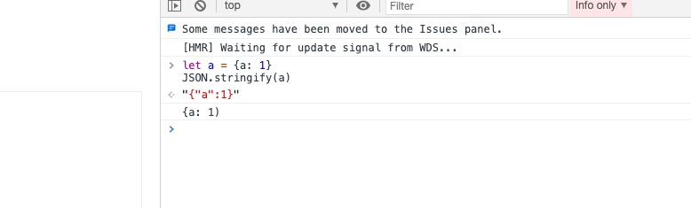

## 前言
最近在调研vue3+ts的项目， 每次在写业务的时候都需要根据后端的接口去写一遍接口类型， 有点难受， 于是就有了这个项目。
通过一个json对象， 生成需要的类型声明。

## 技术调研
基础逻辑类似与对象的深拷贝类似， 递归的判断对象的每一个key， 判断其属性然后进行字符串拼接。
输入代码的地方准备找一个web的代码编辑器用来获取json的值， 处理好后输入到右边。 

最后决定使用vue3 + ts来处理展示页面， 用codemirror来做代码的编辑。

## codemirror
codemirror是一个非常成熟的web代码编辑工具， 通过各种插件可以实现在web端进行代码编辑。
本项目中使用了这些样式和插件
 ```typescript
import CodeMirror, { Editor as CodeEditorType } from 'codemirror'
import 'codemirror/lib/codemirror.css'
// 主题
import 'codemirror/theme/eclipse.css'
// 代码高亮
import 'codemirror/mode/javascript/javascript.js'
// 支持代码折叠
import 'codemirror/addon/fold/foldgutter.css'
import 'codemirror/addon/fold/foldgutter.js'
import 'codemirror/addon/fold/brace-fold.js'
import 'codemirror/addon/fold/comment-fold.js'
import 'codemirror/addon/fold/foldcode.js'
// 括号匹配
import 'codemirror/addon/edit/matchbrackets.js'
// 行注释
import 'codemirror/addon/comment/comment.js'

export default CodeMirror

```
vue代码用组合式APi， 将json编辑和ts编辑的逻辑独立开

### ts编辑框
```typescript
import CodeMirror from './import'
import { Editor as CodeEditorType } from 'codemirror'
import { onMounted } from 'vue'

interface IUseCodeEditorType {
  codeEditor?: CodeEditorType | null;
  setCode(s: string): void;
  clearCode(): void;
}

export default function (id: string): IUseCodeEditorType {
  let codeEditor!: CodeEditorType
  onMounted(() => {
    const dom = document.getElementById(id) as HTMLTextAreaElement
    codeEditor = CodeMirror.fromTextArea(dom, {
      mode: 'application/json',
      lineNumbers: true, // 代码行号
      tabSize: 2, // 锁进
      smartIndent: true, // 是否智能缩进
      lineWrapping: true,
      foldGutter: true, // 代码折叠
      gutters: ['CodeMirror-linenumbers', 'CodeMirror-foldgutter', 'CodeMirror-lint-markers'],
      matchBrackets: true
    })
  })

  // 将处理好的代码展示出来
  const setCode = (codeString: string) => {
    codeEditor.setValue(codeString)
  }

  const clearCode = () => {
    codeEditor.setValue('')
  }

  return {
    setCode,
    clearCode
  }
}

```

### json编辑框
这里编辑json数据
```typescript
import CodeMirror from './import'
import { Editor as CodeEditorType } from 'codemirror'
import { onMounted, ref, Ref, reactive, toRaw } from 'vue'
import Json2inter, { IOption } from './json2inter'
import { checkJson, getJson, getConfig, setConfig } from './utils'

interface IUseJsonEditorType {
  jsonEditor: CodeEditorType | null;
  isErrorJson: Ref<boolean>;
  foldJson(): void;
  getJsonEditorValue(): string;
  setJson(): void;
  jsonOption: IOption;
  changeConfig(): void;
}

export default function (id: string): IUseJsonEditorType {
  let jsonEditor!: CodeEditorType
  const isErrorJson = ref(false)

  // getConfig需要做缓存
  const jsonOption = reactive(getConfig())

  const json2interConst = new Json2inter(toRaw(jsonOption))

  onMounted(() => {
    const dom = document.getElementById(id) as HTMLTextAreaElement
    jsonEditor = CodeMirror.fromTextArea(dom, {
      value: '',
      mode: 'application/json',
      theme: 'eclipse',
      tabSize: 2,
      smartIndent: true, // 是否智能缩进
      lineWrapping: true,
      foldGutter: true,
      gutters: ['CodeMirror-linenumbers', 'CodeMirror-foldgutter', 'CodeMirror-lint-markers'],
      matchBrackets: true
    })
    jsonEditor.on('blur', (e: CodeEditorType) => {
      const value = e.getValue()
      isErrorJson.value = checkJson(value)
    })
  })

  const getValue = () => {
    return jsonEditor.getValue()
  }

  const getJsonEditorValue = () => {
    const value = jsonEditor.getValue()
    const json = getJson(value)
    return json2interConst.interfaceDefinition(json)
  }

  const foldJson = () => {
    const valueString = getValue()
    const json = getJson(valueString)
    const dataString = JSON.stringify(json, null, 2)
    jsonEditor.setValue(dataString)
  }

  const setJson = () => {
    jsonEditor.setValue('')
  }

  const changeConfig = () => {
    json2interConst.memberAfterSemicolon = jsonOption.memberAfterSemicolon ? ';' : ''
    json2interConst.interfaceAfterSemicolon = jsonOption.interfaceAfterSemicolon ? ';' : ''
    json2interConst.interfacePrefix = jsonOption.interfacePrefix
    json2interConst.globalName = jsonOption.globalName
    json2interConst.isExportAll = jsonOption.isExportAll
    setConfig(jsonOption)
  }

  return {
    jsonEditor,
    isErrorJson,
    foldJson,
    getJsonEditorValue,
    setJson,
    jsonOption,
    changeConfig
  }
}

```

### 一些小坑
我们从输入框拿到的字符串其实并不是JSON类型的string， 直接JSON.parse(value)会提示类型错误


如图， 下面的`{a: 1}`是从输入框获取的字符串。 比真正的JSONString要少一个引号,
所以要通过下面的方法转码成可以解析的string
```typescript
/**
 * 获取json
 * @param value
 */
export function getJson (value: string): object {
  let jsonString: object = {}
  try {
    jsonString = JSON.parse(value)
  } catch (parseErr) {
    try {
      // eslint-disable-next-line no-eval
      jsonString = eval('(' + value + ')')
    } catch (evalErr) {
      jsonString = evalErr.message
    }
  }
  return jsonString
}
```

### 核心方法
拿到json之后， 就要开始进行字符串遍历和拼接了, 这里的逻辑和对象的深拷贝类似， 
如果监测到一个Key是简单类型， 则直接凭借上类型和key， 如果是array或者object， 则递归
```typescript

import humps from 'humps'

export interface IOption {
  globalName?: string;
  indent?: string;
  memberAfterSemicolon?: boolean;
  interfaceAfterSemicolon?: boolean;
  isExportAll?: boolean;
  interfacePrefix?: string;
}

interface IWaitProcessObjs {
  key: string;
  value: any;
}

interface IJson {
  [key: string]: string | number | boolean | IJson | IArray;
}

type IArray = IJson[] | string[] | number[] | boolean[]

/**
 * 判断数组的类型
 * @param arr
 * @returns {string}
 */
export function isBaseType (arr: any[]) {
  const type = typeof arr[0]
  for (let i = 1; i < arr.length; i++) {
    if (type !== typeof arr[i]) {
      return 'any'
    }
  }
  return type
}

// 直接拼接基本类型
export const normalTypes = ['string', 'number', 'boolean']

export default class JSON2Inter {
  globalName: string // 全局接口名称
  indent: string // 生成的代码缩进 一个tab
  memberAfterSemicolon: string // 接口成员之后是否需要分号
  interfaceAfterSemicolon: string // 接口之后是否需要分号
  isExportAll: boolean // 是否导出全部成员， 默认全部导出
  interfacePrefix: string // 接口前缀

  #interfaceNames: string[] = [] // 接口名称， 用来防止重复
  #waitProcessObjs: IWaitProcessObjs[] = [] // 待处理的对象

  constructor (option: IOption = {}) {
    this.globalName = option.globalName || 'IGlobalTypes'
    this.indent = option.indent || '  '
    this.memberAfterSemicolon = option.memberAfterSemicolon ? ';' : ''
    this.interfaceAfterSemicolon = option.interfaceAfterSemicolon ? ';' : ''
    this.isExportAll = Boolean(option.isExportAll)
    this.interfacePrefix = option.interfacePrefix || 'I'
  }

  /**
   * 首位字母大写
   * @param key
   */
  getBaseName (key: string): string {
    const firstName = key.substring(0, 1)
    const lastName = key.substring(1)
    return firstName.toUpperCase() + lastName
  }

  /**
   * 获取接口名称， 如果有重复的则加上序号
   * @param name 返回字段key
   * @returns {string} 返回处理过的名称
   */
  getOnlyInterfaceName (name: string): string {
    if (!this.#interfaceNames.includes(name)) {
      return name
    }
    // 取最后一位
    let lastCharacter: string | number = name.slice(-1)
    if (lastCharacter >= '0' && lastCharacter <= '9') {
      lastCharacter = parseInt(lastCharacter) + 1
      return this.getOnlyInterfaceName(name.substring(0, name.length - 1) + lastCharacter)
    } else {
      return this.getOnlyInterfaceName(name + '1')
    }
  }

  /**
   * 获取接口名称
   * @param key
   */
  getInterfaceName (key: string) {
    let fullName: string = this.interfacePrefix + this.getBaseName(key)
    fullName = this.getOnlyInterfaceName(fullName)
    this.#interfaceNames.push(fullName)
    return fullName
  }

  /**
   * 生成包裹
   * @param key
   * @param string
   */
  getWrap (key: string, string: string) {
    if (this.isExportAll) {
      return `export interface ${key} {\n${string}}`
    }
    return `interface ${key} {\n${string}}`
  }

  /**
   * 生成包裹
   * @param key
   * @param string
   */
  getExportWrap (key: string, string: string) {
    return `export default interface ${key} {\n${string}}`
  }

  /**
   * 处理数组
   * @param array 包含当前数组的json对象
   * @param key 数组对应的key
   * @returns {*}
   */
  handleArray (array: IArray, key: string) {
    let inters = ''
    if (array.length === 0) {
      inters += `${this.indent}${key}: any[]${this.memberAfterSemicolon}\n`
      return inters
    }

    // 如果是而为数组
    if (array[0] instanceof Array) {
      // 判断数组是否都为boolean number string等基本类型
      inters += `${this.indent}${key}:any[]${this.memberAfterSemicolon}\n`
    } else {
      // 有可能是对象也有可能是普通类型，如果是对象，类型按照第一个元素类型定义，如果都为普通类型，则指定为具体类型数组
      // 否则为any数组
      // 判断是否为 [1,2,3]形式处理
      if (normalTypes.includes(typeof array[0])) {
        const type = isBaseType(array)
        inters += `${this.indent}${key}: ${type + '[]'}${this.memberAfterSemicolon}\n`
      } else {
        const interfaceName = this.getInterfaceName(key)
        inters += `${this.indent}${key}: ${interfaceName + '[]'}${this.memberAfterSemicolon}\n`
        this.#waitProcessObjs.push({
          key: interfaceName,
          value: array[0]
        })
      }
    }
    return inters
  }

  /**
   * 处理json
   * @param json 待处理json
   * @param name 接口名字
   * @param first 是否为第一级
   * @returns {*}
   */
  parseJson (json: IJson, name: string, first?: boolean) {
    const keys: string[] = Reflect.ownKeys(json) as string[]
    let type
    let inters = ''
    for (const key of keys) {
      // 判断值类型
      type = typeof json[key]
      if (normalTypes.includes(type)) {
        inters += `${this.indent}${key}: ${type}${this.memberAfterSemicolon}\n`
      } else if (Array.isArray(json[key])) {
        inters += this.handleArray(json[key] as IArray, key)
      } else if (json[key] instanceof Object) {
        const interfaceName = this.getInterfaceName(key)
        inters += `${this.indent}${key}: ${interfaceName}${this.memberAfterSemicolon}\n`
        this.#waitProcessObjs.push({
          key: interfaceName,
          value: json[key]
        })
      }
    }
    if (first) {
      return this.getExportWrap(this.globalName, inters)
    }
    return this.getWrap(name, inters)
  }

  /**
   * 导出接口定义
   * @param res json字符串
   * @returns {*}
   */
  interfaceDefinition (res: object) {
    this.clear()
    const json = humps.camelizeKeys(res) as IJson
    let result = ''
    try {
      result = this.parseJson(json, this.getInterfaceName(this.globalName), true)
      for (const obj of this.#waitProcessObjs) {
        result += `${this.interfaceAfterSemicolon}\n \n`
        result += this.parseJson(obj.value, obj.key)
      }
      result += `${this.interfaceAfterSemicolon}\n \n`
    } catch (e) {
      result = e.message
    }
    return result
  }

  /**
   * 清除副作用
   */
  clear () {
    this.#interfaceNames = []
    this.#waitProcessObjs = []
  }
}

```
