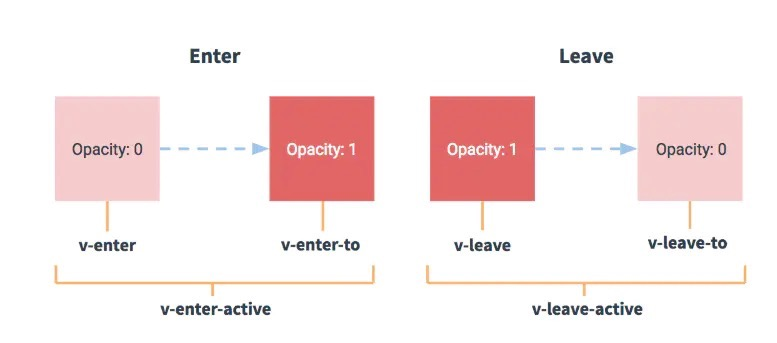
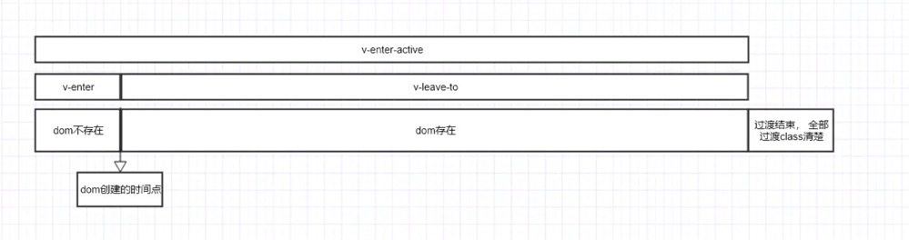
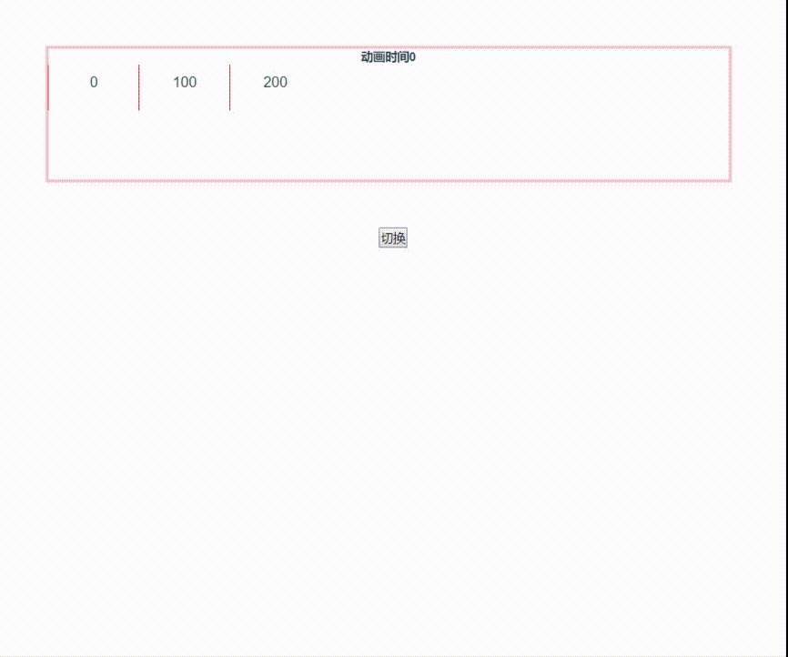
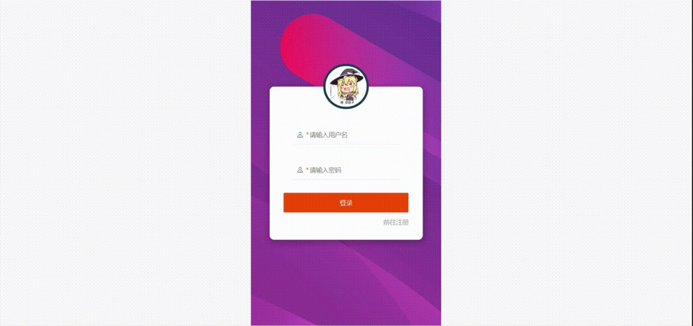
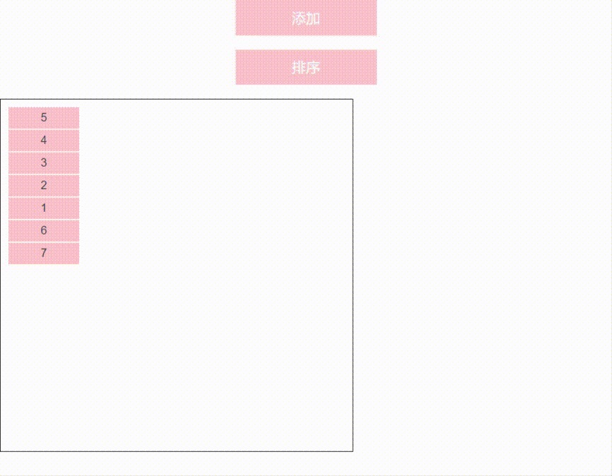

 
vue提供的了transition组件来实现组件的过渡和路由的过渡，合理使用这个组建可以让我们的页面更加的灵活，提高用户体验。

### 概念
在进入/离开的过渡中， 会有6个class的切换， 抄一张官方的图


> v-enter：定义进入过渡的开始状态。在元素被插入之前生效，在元素被插入之后的下一帧移除。

> v-enter-active：定义进入过渡生效时的状态。在整个进入过渡的阶段中应用，在元素被插入之前生效，在过渡/动画完成之后移除。这个类可以被用来定义进入过渡的过程时间，延迟和曲线函数。

> v-enter-to: 2.1.8版及以上 定义进入过渡的结束状态。在元素被插入之后下一帧生效 (与此同时 v-enter 被移除)，在过渡/动画完成之后移除。

> v-leave: 定义离开过渡的开始状态。在离开过渡被触发时立刻生效，下一帧被移除。

> v-leave-active：定义离开过渡生效时的状态。在整个离开过渡的阶段中应用，在离开过渡被触发时立刻生效，在过渡/动画完成之后移除。这个类可以被用来定义离开过渡的过程时间，延迟和曲线函数。

> v-leave-to: 2.1.8版及以上 定义离开过渡的结束状态。在离开过渡被触发之后下一帧生效 (与此同时 v-leave 被删除)，在过渡/动画完成之后移除。

看起来还是有有点乱，先来捋一下。



enter 定义开始的状态， active定义过程， enter定义结束， 但是在实际进行的时候是有交叉的。
通过断点可以发现，
- 添加v-enter
- 添加v-enter-active, 
- 卸载v-enter
- 添加v-ernter-to
- 卸载v-enter-to和v-enter-active
```
// transition: all 2s; 
    .move-enter {
      margin-left: 0;
    }
    .move-enter-active {
       margin-left: 100px;
    }
    .move-enter-to {
      margin-left: 200px;
    }
```

例如在上面这种情况下， 过渡动画会怎么进行呢？




这里要注意两点。
- enter-active覆盖掉了enter的起点位置
- 一共经过了两次过渡， enter-to是在active结束之后开始的， 所以第四秒， 才回到dom元素本身的位置。

所以官方文档之， 也是使用v-enter定义起点位置， 在enter-active中控制效果。

### 利用class实现过渡效果
在这6个class之上， 利用transition或者动画， 都可以实现我们需要的效果。
举个栗子， 这里我们直接将所有的路由改变都定义一个过渡效果，
> appear属性表示页面初次加载的时候也适用于动画
```
    <transition appear name="move">
        <router-view></router-view>
    </transition>
```
```
@keyframes animationIn {
  0% {
    transform: translate(-100%, 0);
  }
  100% {
    transform: translate(0, 0);
  }
}
@keyframes animationOut {
  0% {
    transform: translate(0, 0);
  }
  100% {
    transform: translate(100%, 0);
  }
}

.move-enter {
  transform: translate(-100%, 0);
  position: absolute!important;
  z-index: 999;
  top: 0;
  left: 0;
  width: 100%;
}
.move-enter-active {
  animation: animationIn 0.2s;
  position: absolute!important; // 进入的组件要覆盖掉移除的组件，参考 //https://cn.vuejs.org/v2/guide/transitions.html#%E8%BF%87%E6%B8%A1%E6%A8%A1%E5%BC%8F
  z-index: 999;
  top: 0;
  left: 0;
  width: 100%;
}
.move-leave {
  transform: translate(0, 0);
}
.move-leave-active {
  animation: animationOut 0.2s;
}

```
效果


### JavaScript 钩子

这些钩子函数可以结合 CSS transitions/animations 使用
```
<transition
  v-on:before-enter="beforeEnter"
  v-on:enter="enter"
  v-on:after-enter="afterEnter"
  v-on:enter-cancelled="enterCancelled"

  v-on:before-leave="beforeLeave"
  v-on:leave="leave"
  v-on:after-leave="afterLeave"
  v-on:leave-cancelled="leaveCancelled"
>
  <!-- ... -->
</transition>
```

在这些钩子中， 可以使用其他第三方库，回调中的el将是真实的dom元素
举个栗子, 这里使用了官方推荐的Velocity.js作为动画库
```
    <div class="main">
      <transition name="showRect" appear
                  @before-enter="handleBeforeEnter"
                  @enter="handleEnter"
                  @after-enter="handleAfterEnter"
                  @before-leave="handleBeforeLeave"
                  @leave="handleLeave"
                  @after-leave="handleAfterLeave"
                  :css="false">
        <div class="box" v-if="show"></div>
      </transition>
    </div>
    <button @click="start">切换</button>
```
```
       methods: {
      start() {
        this.show = !this.show
      },
      handleBeforeEnter: function (el) {
        el.style.opacity = 0;
        console.log('方块显示动画即将执行');
      },
      handleEnter: function (el, done) {
        Velocity(el, 'stop');
        Velocity(el, {
          backgroundColor: '#0085eb',
          opacity: 1,
          translateX: 260,
          rotateZ: ['360deg', 0]
        }, {
          duration: 1000,
          easing: [ 0.4, 0.01, 0.165, 0.99 ],
          complete: done
        });
        console.log('方块显示动画执行中...');
      },
      handleAfterEnter: function (el) {
        console.log('方块显示动画结束');
      },
      handleBeforeLeave: function (el) {
        console.log('方块隐藏动画即将执行');
      },
      handleLeave: function (el, done) {
        Velocity(el, 'stop');
        Velocity(el, {
          backgroundColor: '#4dd0e1',
          opacity: 0,
          translateX: 0,
          rotateZ: [0, '360deg']
        }, {
          duration: 1000,
          easing: [ 0.4, 0.01, 0.165, 0.99 ],
          complete: done
        });
        console.log('方块隐藏动画执行中...');
      },
      handleAfterLeave: function (el) {
        console.log('方块隐藏动画结束');
      }
    }
```


### 列表过渡

vue还提供了transition-group组件， 作为列表过渡的容器
> 不同于 `<transition>`，它会以一个真实元素呈现：默认为一个 `<span>`。你也可以通过 tag 特性更换为其他元素

> transition-group 拥特别的v-move属性，它会在元素的改变定位的过程中应用， 效果可参见官网。

其他的就不抄官网了

##### 列表过渡中， 可以结合js钩子， 实现一些特殊的效果
举个栗子

```
<template>
  <div>
    <div class="btn" @click="addItem">添加</div>
    <div class="btn" @click="sort">排序</div>
    <div class="box">
      <div class="item-bar">
        <transition-group name="fade" tag="p" appear
        v-on:before-enter="beforeEnter"
        v-on:after-enter="afterEnter">
        // 这里的data-index 是一个识别标识， 便于在js钩子中获得当前元素的序号
          <div class="item" v-for="(i, index) in list" :key="i" :data-index="index">{{i}}</div>
        </transition-group>
      </div>
    </div>
  </div>
</template>
```

```
<script lang="ts">
  import Vue from "vue";
  export default Vue.extend({
    name: "home",
    data() {
      return {
        show: true,
        list: [5,4,3,2,1],
        nextNum: 6
      };
    },
    methods: {
      showDom() {
        this.show = !this.show
      },
      beforeEnter: function (el: any) {
        el.style.opacity = 0 // 每个元素插入之前， 透明度为0
        let index = el.dataset.index  每次可能插入多个元素，
        // 页面加载时先展示5个
        if (index < 5) {
            //设置动画延迟， 实现按续插入的效果
          el.style.animationDelay = el.dataset.index * 0.3 + 's'
        }
      },
      afterEnter: function (el) {
        el.style.opacity = 1
        console.log('afterEnter')
      },
      addItem() {
        this.list.push(this.nextNum++)
      },
      sort() {
        this.list = this.list.sort((a, b) => a -b)
      }
    }
  });
</script>
```

```
 @keyframes animat {
    0% {
      margin-left: 300px;
      opacity: 0;
    }
    100% {
      margin-left: 0;
      opacity: 1;
    }
  }
  .fade-enter {
    opacity: 0;
    margin-left: 300px;
  }
  .fade-enter-active {
    opacity: 0;
    animation: animat 1s;
  }
  .fade-enter-to {
    opacity: 1;
    margin-left: 0;
  }

  .fade-move {
    transition: all 0.3s;
  }
  .fade-leave {
    left: 10px;
  }
  .fade-leave-active {
    transition: all 2s ease-out;
  }
  .fade-leave-to {
    left: -100%;
  }
```

效果



> 原文发表在掘金<a> https://juejin.im/post/5ba3583b5188255c6a043671 </a>, 然后搬回来的时候gif全都不能动了。
这边文章就在这里做一个备份吧
